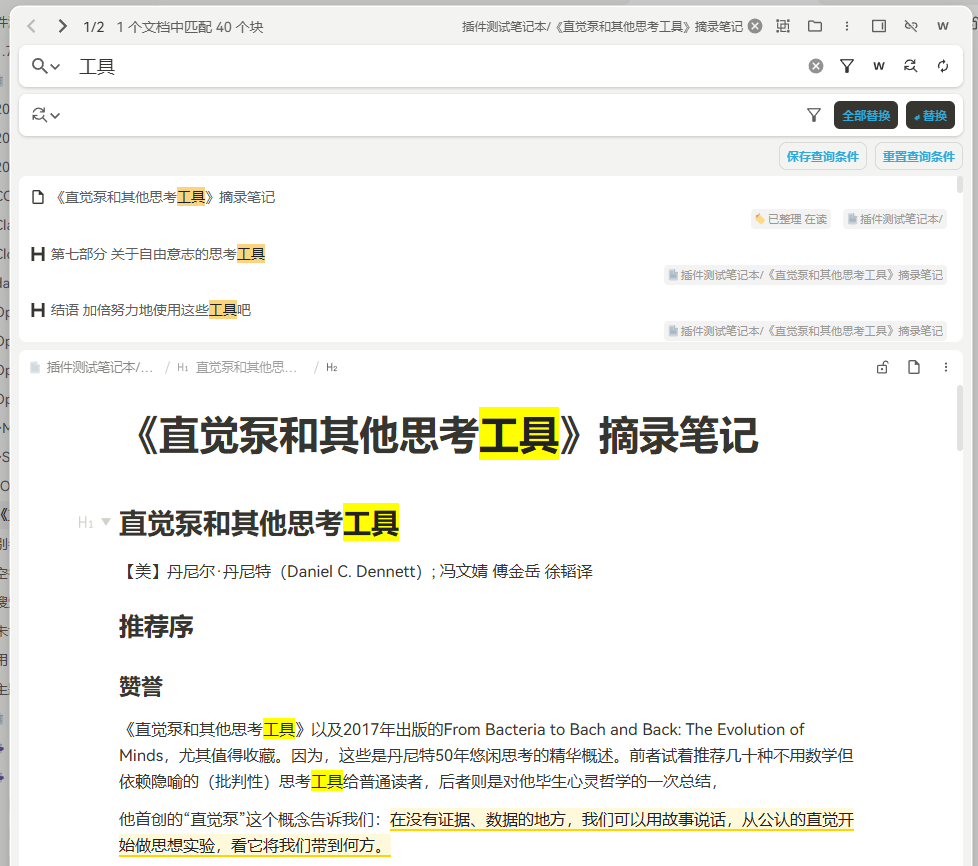
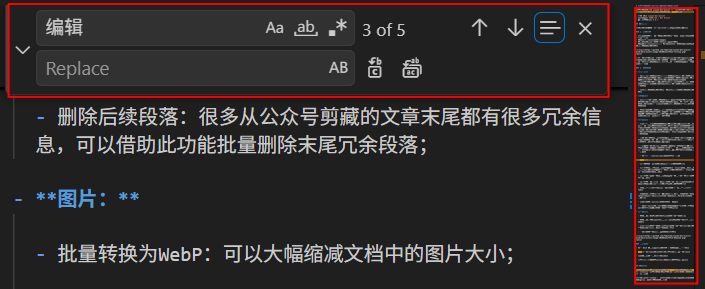
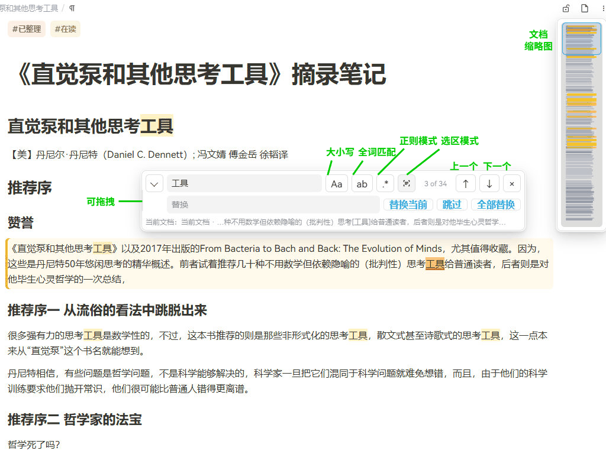
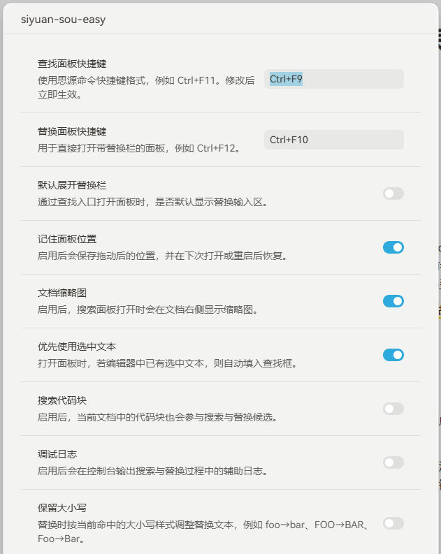

# 思源“搜 easy”插件——解决日常难题，逐个搜索，逐个替换，so easy！

## 楔子

我的主力笔记软件切换到思源笔记已经有大半年了，切换之前我就听说过关于思源笔记“小众”、“极客”的名声。我一开始并没有这种感觉，因为思源笔记流畅的编辑体验给了我很好的第一印象，开箱即用，哪里极客了，没有啊。但后来让我觉得“嗯，确实有点小众、够极客”的第一个事情并不是听起来技术化的数据库、SQL 等——因为我在切换笔记软件之前的调研中已经对此有心理准备，而且认为基于 SQL 数据库的可扩展性是思源笔记优势所在——而是日常的查找、替换操作。

在文档中查找、替换文字居然是弹出一个独立窗口，然后在这个一点也不直观的窗口操作，而不是在原文档所见即所得的操作。搜索到的结果不但跟原文顺序不一样，而且替换操作是整个段落替换，无法逐个关键词替换！这个颠覆传统的操作体验给了我不小的震撼 :-(

## “搜 easy”，逐个搜索替换，so easy！

搜索替换这么高频的日常操作，应该有不少人吐槽吧？在我的印象里，搜索替换的操作体验，不说 Word 等强大的富文本编辑软件，在文本编辑器里 VS code 做的就很不错啊，逐个搜索、逐个替换、可跳过、大小写开关等，强大易用。

但我在集市里找了一圈，好像也没有特别合适的替代插件。于是这两天就参照 VS code 复刻了一个工具：“搜 easy”，逐个搜索替换，so easy！

## 重要说明

本插件涉及文档内容编辑，此类变更无法使用编辑回退，只能通过思源笔记的“数据历史”恢复，存在一定风险。

本插件在发布前虽已经过开发者本人试用验证，但仍可能有不可预知的Bug，建议不要在重要文档使用。
