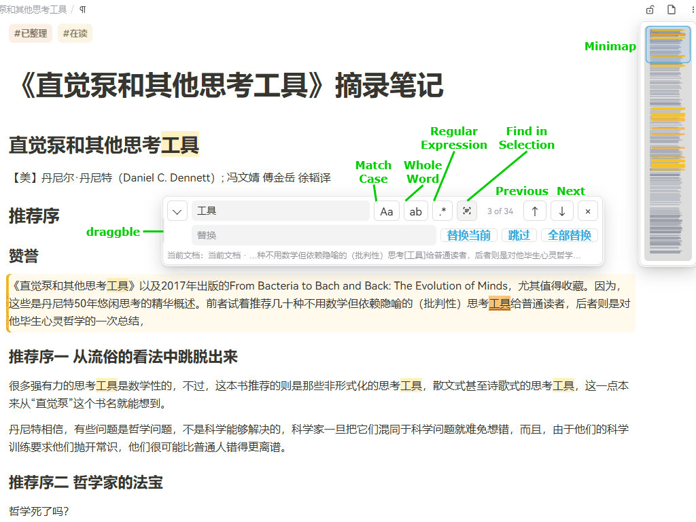
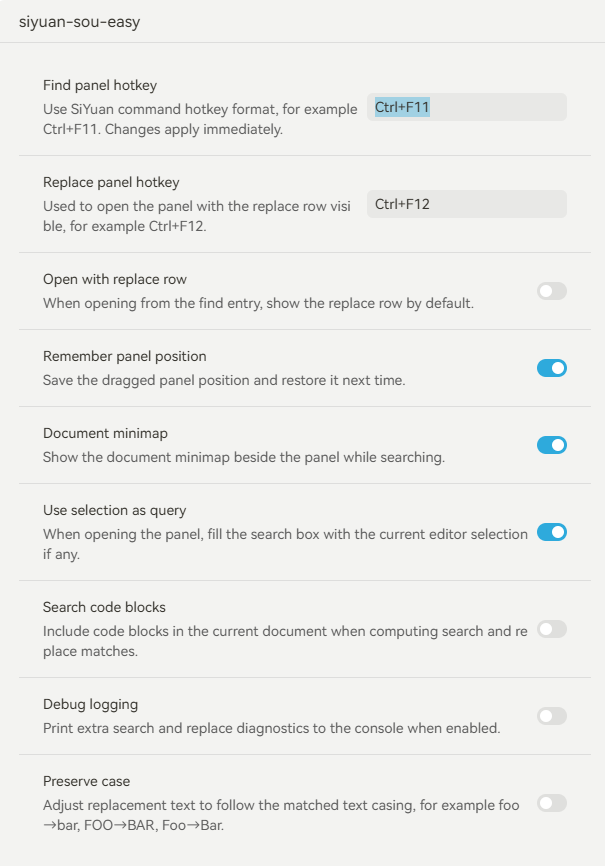

# Friendly Search Replace

**English** · [简体中文](README_zh_CN.md)

A SiYuan plugin that brings a VS Code style find-and-replace experience.

## Features

- Search within the active document.
- Previous / next navigation with current match count.
- Match case, whole word, and regular expression modes.
- Search and replace inside the current selection.
- Replace current, skip current, and replace all actions.
- Preserve the casing pattern of the current match during replacement.
- Search attribute-view content in read-only preview form.
- Top bar entry, command palette entry, and configurable hotkeys.
- Draggable, resizable panel with remembered position.
- Document minimap with live match synchronization.

## Important Note

This plugin involves editing document content, and such changes cannot be undone using the editor's undo function. Recovery is only possible through SiYuan's "Data History," which carries certain risks.

Although this plugin has been tested by the developer before release, it may still contain unforeseen bugs. It is recommended not to use it on important documents.