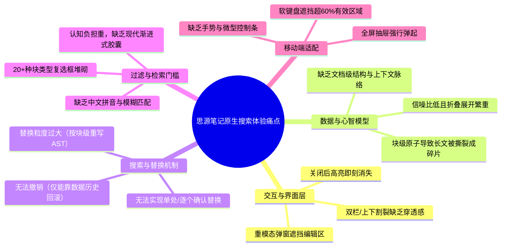
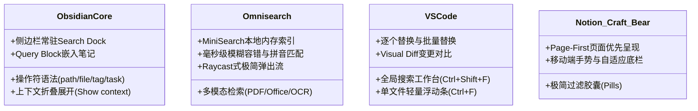
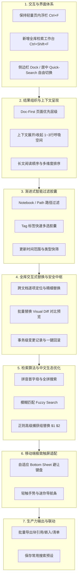
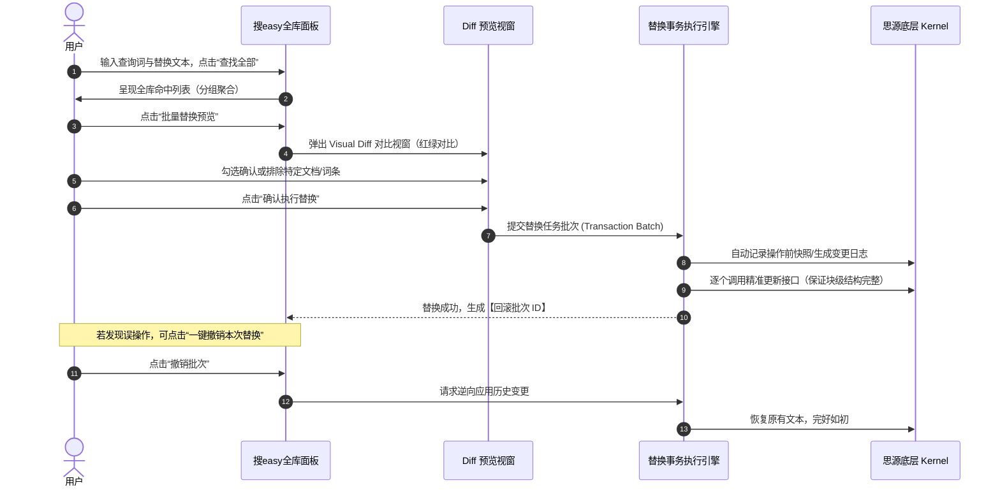
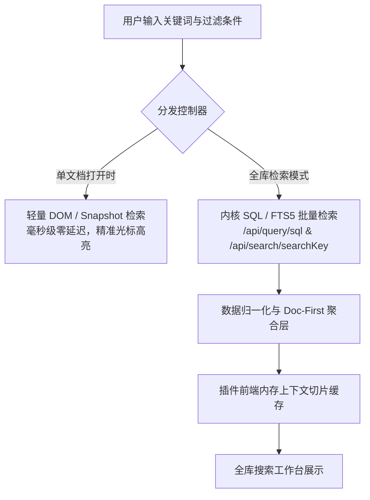

# 思源笔记全文与全库搜索深度分析及“搜 easy”演进策略报告

> **报告版本**：v1.0.0  
> **制定日期**：2026-10-05  
> **目标项目**：`siyuan-sou-easy`（思源笔记增强搜索替换插件）与 `siyuan-note`（思源笔记核心应用）  
> **报告定位**：思源笔记原生全库/全文搜索体验痛点剖析、横向竞品（Obsidian 生态及主流笔记工具）竞争力调研，以及 `siyuan-sou-easy` 扩展全库搜索的产品演进与特性设计方案。

---

## 一、 执行摘要（Executive Summary）

思源笔记（SiYuan）作为一款基于本地优先、以“块（Block）”为核心原子数据模型、底层集成 SQLite 与自研内核（Kernel）的知识管理工具，具备强大的结构化双链与 SQL 查询潜力。然而，在日常高频的**全文检索与搜索替换**体验上，原生设计长期受到用户社区的广泛吐槽。

本报告通过逆向分析思源笔记源码架构、结合用户实际交互截图，深度解构了原生搜索在**交互形态、块级心智错位、粗粒度替换风险、筛选复杂度与移动端体验**上的五大核心痛点。同时，深入调研了 **Obsidian 原生搜索体系、社区标杆插件（Omnisearch、Another Quick Switcher 等）** 以及现代生产力工具（VS Code、Notion、Bear 等）的成熟范式。

针对当前 `siyuan-sou-easy` 插件从“单文档内逐个精准搜索替换”向**“全库跨文档搜索与重构中心”**跨越式升级的目标，本报告提出了完整的产品竞争力矩阵与七大功能演进模块，并给出了具体的技术实现路径、安全防御策略和版本里程碑规划。

---

## 二、 思源笔记原生搜索深度剖析与体验痛点

结合思源笔记源码（前端 `app/src/search/`、底层内核 `kernel/model/search.go` 及 `kernel/api/`）与实际交互界面（参见用户反馈截图），思源笔记原生在处理“全文与全库文档搜索”时存在以下系统性问题：



### 2.1 交互形态：重弹窗（Modal）强打断，缺乏沉浸式穿透

- **模态强行打断工作流**：在思源中按下快捷键检索时，默认唤出的是居中大弹窗（或独立 Layout Tab）。这一巨型窗口直接遮蔽了正在书写/阅读的编辑区，打断了用户的注意力连续性。
- **割裂的预览机制**：原生搜索在弹窗内部集成了 `searchPreview`（包含一个只读或临时的 Protyle 实例）。用户在弹窗左/上方的列表选择结果，在弹窗右/下方查看预览。这种“在弹窗里套一个微缩编辑器”的设计，导致用户无法在真实文档上下文中直接滚动定位，关闭弹窗后高亮也随之消失，无法做到“边搜索、边定位、边即时修改”。

### 2.2 认知错位：“块级优先（Block-First）”撕裂长文档上下文

思源笔记的底层由一个个独立的 Block（段落块、标题块、列表项等）构成，SQLite FTS5 索引也是针对 Block 建立。这导致原生搜索呈现出强烈的“块级思维”，但与用户的人性化认知存在天然鸿沟：

1. **信息碎片化（Fragmentation）**：一篇长文档中如果命中了 15 处，原生结果列表会展示为 15 个孤立散落的块（如用户截图中的 `d` 块、`h` 块）。长文的篇章逻辑结构、段落先后顺承关系被彻底撕碎。
2. **缺乏上下文呼吸空间**：原生列表仅显示单块内容或单行摘要，用户无法感知命中点前后 1~2 句话在交代什么，往往必须频繁点击以切换下方的预览区，操作链路繁琐，获取有效信息的信噪比极低。
3. **层级折叠负担繁重**：多笔记本、多层文档树下，用户必须在密密麻麻的路径树（如 `笔记本/文件夹/文档名`）和子块列表中反复点击箭头折叠或展开，极易产生视觉疲劳。

### 2.3 替换功能：粗粒度块重写，风险极高且不可逆

通过对 `kernel/model/search.go` 中 `FindReplaceInBox` 源码的深入剖析，发现了原生替换最致命的技术局限与设计硬伤：

- **无法逐个词汇交互式替换（No In-place Interactive Replace）**：原生替换操作将 `ids`（块 ID）打包发送给内核，内核遍历该块 AST 语法树下的所有 `NodeText` 进行全量文本正则或字符串重写。**原生完全不支持像 Word 或 VS Code 那样，让光标聚焦在当前第 N 处命中词上，按下快捷键仅替换当前这一处、自动跳转到下一处。**
- **不可编辑撤销（No Undo/Redo）**：由于原生替换绕过了前端编辑器的撤销栈（Transaction Undo Stack），直接由 Go 内核生成历史并覆写文件树，用户在误替换后**无法通过 `Ctrl+Z` 撤销**！
- **极度依赖“数据历史”快照（Data History）**：一旦替换出错（例如误把常用代词全库替换），用户必须手动翻找“数据历史”，按时间戳整篇文档回滚，可能导致替换之后写的其他内容同步丢失，心智门槛极高，极易引发数据灾难。

### 2.4 检索过滤：选项堆砌，复杂度过载

- **过载的复选框列表**：在原生搜索过滤配置中，罗列了包括段落、标题、列表、列表项、代码块、HTML、数学公式、表格、引述、折叠卡片、脑图、脑图子项、自定义块、数据库等 **20 余种块类型开关**。这种将底层数据结构全盘抛给用户的做法，对普通用户是巨大的认知负担。
- **缺乏渐进式与人性化语法**：高级用户希望快速根据“标签”、“更新时间”、“指定笔记本”进行过滤，原生需要多次点击设置弹窗；而查询语法门槛高，缺少类似现代化 IDE 的快捷过滤胶囊（Pill Filters）。
- **中文检索能力单薄**：原生依赖 SQLite FTS 与简单分词，对中文的**拼音首字母检索（如输入 `cpjl` 搜 `产品经理`）、全拼检索、拼写模糊容错**缺乏开箱即用的支持。

### 2.5 移动端体验：生硬移植，可用性极差

- **软键盘遮挡灾难**：在移动端（iOS / Android / 平板），原生搜索弹窗以全屏抽屉形式展开。当手机输入法虚拟键盘弹出时，可支配的屏幕垂直高度缩水 50% 以上，搜索列表被严重压缩，底部的预览区和控制按钮被键盘彻底顶飞或遮挡。
- **缺乏移动端手势**：没有针对触屏做手势优化，无法通过左右滑动在命中项间快速切换，上一处/下一处按钮极小，单手操作几乎无法使用。

---

## 三、 跨平台竞品与同类生态插件调研

为了确立最具竞争力的产品方案，本报告对 Obsidian 官方与第三方插件生态、以及其他成熟的桌面/移动笔记应用进行了全景调研。



### 3.1 Obsidian 官方原生搜索（Core Search）

| 维度 | Obsidian 官方原生搜索表现 | 对思源笔记的启示 |
| :--- | :--- | :--- |
| **容器形态** | 侧边栏常驻面板（Search Dock）或快捷弹窗，与编辑区无遮挡并存。 | 检索与编辑应当是协同共存的，不能用巨型模态将编辑区彻底封死。 |
| **层级呈现** | **文档优先（Doc-First）**：以 Markdown 文件为单元分组，下方展示命中行。 | 必须确立文档维度的第一层级，聚合散落的命中块。 |
| **上下文控制** | 提供 `Show more context` 开关，支持上下滑动调整查看命中点前后 1~5 行。 | 用户需要直观阅读命中前后的语义，而不是生硬的单行切片。 |
| **语法体系** | 内置丰富的操作符：`file:`, `path:`, `tag:`, `line:`, `section:`, `task:`。 | 采用直观的操作符语法代替密密麻麻的勾选框，兼顾新手与极客。 |
| **生产力复用** | 结果可直接复制为 Wikilink 列表，并支持 ````query ```` 块动态嵌入笔记。 | 搜索结果应能反哺笔记创作，支持一键导出为引用或任务清单。 |

### 3.2 Obsidian 社区杀手级插件调研

#### 1. Omnisearch（全格式极速 AI / 模糊搜索）
- **核心机制**：在后台基于 `MiniSearch` 构建轻量倒排索引，常驻内存，检索过程完全脱离文件 IO，做到真正的键入即呈现（响应时间 < 20ms）。
- **智能特性**：支持中英文分词容错、拼音检索、词形还原（Stemming）、权重计算（BM25 变体）。支持直接索引并检索 PDF 内部正文、Word 文档以及图像 OCR 文本。
- **交互设计**：类似 Alfred / Raycast / Spotlight 的极简悬浮搜索框，纯键盘上下导航，回车直达具体行并高亮聚焦。

#### 2. Another Quick Switcher / Better Search Views
- **核心机制**：强化文件快速切换与全文检索的融合，提供按最后编辑时间倒序、首字母缩写权重加分、悬浮鼠标即时预览（Hover Preview）。
- **视图创新**：将搜索结果转换为可折叠的大纲树，并在树状节点上直接提供快捷动作按钮（定位、复制链接、重命名、快速移动）。

#### 3. Apply Patterns / Global Search and Replace
- **针对替换的痛点**：Obsidian 原生不提供跨文件批量替换，此类插件补齐了全库正则批量重构能力，但大多缺乏交互式单步确认，依赖事前的正则预设。

### 3.3 主流桌面与移动原生应用经验借鉴

1. **VS Code（代码与文档搜索的黄金标杆）**：
   - **双模态分离**：单文件内 `Ctrl+F` 浮动微型工具栏（支持逐个查找、逐个替换、保留大小写）；全局项目 `Ctrl+Shift+F` 独立侧边栏工作台。
   - **精细替换与 Diff 预览**：点击全局替换前，提供侧边/弹窗式的 Visual Diff（文件变更高亮对比），允许用户单个排除不想改的项，确认无误再一键批量写入。
2. **Notion（Page-First 页面心智）**：
   - 全文检索优先给出“最匹配的页面标题与封面”，第二层才展开正文匹配摘要；结合“最近访问（Recent）”与数据库属性（Date, Person, Status）快速组合过滤。
3. **Craft / Bear / Apple Notes（移动端首选设计）**：
   - **自适应底部抽屉（Bottom Sheet）**：检索栏居于顶部或紧贴键盘上方，中间展示卡片式结果切片，手指轻扫（Swipe）即可切换下一篇；软键盘永不遮挡关键信息。

---

## 四、 产品竞争力对比矩阵（Competitor Benchmarking）

以下对比系统性梳理了思源原生、Obsidian 生态、现代编辑器与 `siyuan-sou-easy` 当前及演进后的能力差距：

| 能力维度 | 思源原生搜索 | Obsidian (官方+Omnisearch) | VS Code (全局+局部) | siyuan-sou-easy (当前 v1.3.x) | siyuan-sou-easy (规划全库增强版) |
| :--- | :--- | :--- | :--- | :--- | :--- |
| **交互形态** | 居中大模态弹窗 / 独立Tab | 侧边栏Dock + Spotlight弹窗 | 顶部轻量浮栏 + 侧边栏工作台 | **页内轻量浮动面板（所见即所得）** | **双模态：页内浮栏 + 侧边/全局工作台** |
| **长文上下文** | 孤立块罗列，无前后展开 | 支持展开前后多行上下文 | 树形文件 + 前后行高亮展示 | 真实文档内直接高亮跳转滚动 | **Doc-First + 前后智能上下文切片** |
| **逐个精准替换** | ❌ 不支持（按块全量重写） | ❌ 弱（多需第三方插件） | ✅ 完美（单步确认/跳过） | ✅ **核心优势（单字/词精细替换）** | ✅ **单文档逐个 + 全库跨文档精细替换** |
| **批量替换安全** | ❌ 极高危（仅靠数据历史恢复）| ⚠️ 依赖 Git 或文件快照 | ✅ 极佳（Diff预览+排除） | ⚠️ 依赖撤销/直接修改DOM | ✅ **变更Diff预览 + 批次事务一键回退** |
| **中文与拼音检索** | 仅精确分词/文本匹配 | ✅ Omnisearch 支持拼音/模糊 | 需插件增强 | 仅当前页文本/正则匹配 | ✅ **全拼/首字母拼音 + 模糊容错匹配** |
| **高级属性与特殊块**| 支持但配置繁琐 | Markdown纯文本驱动 | 纯代码/文本 | ✅ **深度适配属性视图/画布/终端** | ✅ **全库属性视图/画布/正文统一检索** |
| **移动端友好度** | 差（大弹窗，键盘遮挡严重）| 良好（侧滑面板无缝适配） | 移动端非主力场景 | 基础适配移动端浮动栏 | ✅ **底部抽屉（Bottom Sheet）+ 手势导航** |
| **结果复用与导出** | 仅单条复制块引用/链接 | 支持嵌入Query块、导链 | 复制路径/文本 | ✅ **提取命中块到剪贴板** | ✅ **批量提链/嵌入块/一键生成任务清单** |

---

## 五、 `siyuan-sou-easy` 扩展全库搜索的功能特性设计建议

为了使 `siyuan-sou-easy` 从“单文档搜索利器”真正蜕变为“思源笔记全库检索与知识重构的第一生产力神器”，建议分为七大核心模块进行功能补齐与优化设计：



### 5.1 模块一：双模态交互架构（Dual-Mode UI/UX）

1. **单文档模式（In-Page Mode，继承与延续原有优势）**：
   - 沿用快捷键 `Ctrl+F`（搜索） / `Ctrl+R`（替换）；
   - 保持极轻量、半透明、支持拖拽与宽度记忆的吸顶浮动条；
   - 聚焦于当前打开文档的秒级检索、高亮同步与单步精准替换。
2. **全库工作台模式（Global Vault Mode，全新扩展）**：
   - 新增快捷键 `Ctrl+Shift+F`（全局搜索替换）；
   - 提供两种挂载形态（用户可在设置中自由切换）：
     - **侧边栏面板（Dock Tab）**：常驻于思源左侧或右侧停靠栏，不挤占编辑区宽度，实现“左边查、右边改”的沉浸式双轨流；
     - **全局快捷搜索台（Quick Switcher / Spotlight 风格）**：类似 Omnisearch / Raycast 的居中悬浮框，聚焦于高频键盘流直达文档或定位内容。

### 5.2 模块二：Doc-First 页面优先与上下文智能聚合

针对原生“碎片化块罗列”痛点，重新设计结果呈现视图结构：

1. **两级视觉树状结构**：
   - **第一层级（文档 Header）**：展示所属笔记本图标、文档路径（面包屑）、文档标题、该文档内命中总次数、最后修改时间；支持单个文档一键折叠/展开；
   - **第二层级（命中上下文切片 Snippet）**：展示命中关键词所在的语句，并**智能截取关键词前后各 30~50 字符（或前后完整句子）**，关键词高亮显示；标明所在块类型标签（如 `[标题]`、`[段落]`、`[表格]`、`[代码]`）。
2. **上下文弹性展开（Context Expandability）**：
   - 在切片旁提供微型“+ / -”按钮或快捷键，允许用户将当前切片临时展开为包含上下一段内容的完整语义块，无需跳转即可读懂全貌。
   - 鼠标悬浮时支持浮窗预览文档内容（为避免误触发，可以要求按下Ctrl后才触发），参考思源笔记原生浮窗预览体验；
3. **多维排序规则**：
   - 支持按“匹配相关度（BM25 分数）”、“文档修改时间（最新优先）”、“文档创建时间”、“文档自然阅读顺序”快速排序。

### 5.3 模块三：渐进式过滤胶囊（Filter Pills）取代复杂选项

摒弃原生 20+ 个复选框的设计，引入类似现代电商与高级搜索工具的**过滤胶囊栏**：

1. **交互式过滤胶囊**：
   - **笔记本/路径胶囊**：点击下拉选择指定笔记本，或通过树形选择器限定某一文件夹分支；
   - **标签胶囊（Tags）**：智能读取当前知识库中的高频标签，支持点击即过滤；
   - **更新时间胶囊**：快捷筛选“今天”、“最近 7 天”、“最近 30 天”或自定义日期；
   - **内容形态简明胶囊**：仅保留“正文”、“标题”、“表格/数据库”、“代码块” 4 个常用核心大类，其余在高级选项中收纳。
2. **即时行内搜索语法兼容**：
   - 高级用户可在搜索框中直接键入类似 `path:日记 tag:工作 需求评审`，插件自动解析并点亮对应的过滤胶囊，极简高效。

### 5.4 模块四：全库级安全可控的交互式替换（杀手级核心护城河）

这是彻底拉开与思源原生差距、解决用户真实生产痛点的核心利器：



1. **全库命中项的精细跳转与单步替换**：
   - 用户可以在全库列表中按 `Enter` 打开文档并直接将光标精准锚定在命中点；
   - 支持快捷键触发“替换当前这一处并跳转到下一个跨文档命中项”，实现跨文档连续校对。
2. **替换变更对比视窗（Visual Diff Modal）**：
   - 在执行全库“全部替换”前，强制或可选弹出 Diff 预览面板；
   - 界面直观显示：`文件路径` -> `变更前文本（红色删除线）` -> `变更后文本（绿色高亮）`；
   - 用户可在列表前勾选复选框，**排除某几个不想替换的文档或句子**。
3. **事务级变更记录与一键回退（Transaction History & Revert）**：
   - 每次全库替换前，插件自动在本地记录一个独立的 Transaction 历史档案（包含受影响的块 ID、原文本、新文本、执行时间戳）；
   - 面板提供“历史批次管理”：用户若在 10 分钟或几天后发现此前替换逻辑有误，可点击对应批次**“一键逆向恢复”**，彻底摆脱原生查“数据历史”的噩梦！

### 5.5 模块五：检索算法增强与中文专属体验

1. **中文拼音搜索（Pinyin Match）**：
   - 内置轻量拼音转换工具（利用现有成熟前端库），支持拼音首字母匹配（如 `wdxg` 检索 `文档修改`）与全拼无声调匹配；
   - 极大提升中文用户快速调取笔记的效率。
2. **模糊容错匹配（Fuzzy Search）**：
   - 针对长单词、代码变量名或专业术语，允许一定编辑距离（Levenshtein Distance）的错别字容错，降低记忆成本。
3. **高级正则捕获组替换**：
   - 支持正则表达式高级替换，如搜索 `(\d{4})-(\d{2})-(\d{2})`，替换为 `$1年$2月$3日`，为知识重构提供极客级支持。

### 5.6 模块六：移动端极致响应式适配（Mobile First）

1. **底部抽屉布局（Bottom Sheet Drawer）**：
   - 在手机端，搜索面板固定在屏幕底部展开，且自带上滑手势拖拽高度（1/3 屏、1/2 屏、全屏）；
   - 当虚拟键盘弹出时，面板自动调整尺寸并贴合键盘上方，检索输入框始终处于拇指舒适区；
2. **微型触控操作条（Mini Floating Controller）**：
   - 当用户点击某个搜索结果跳转到正文后，面板自动收缩为悬浮在屏幕右下角或底部的胶囊条；
   - 胶囊条提供“当前 3/18”、“上一处”、“下一处”、“替换当前”的大图标触控按键，单手即可轻松流畅校对。

### 5.7 模块七：生产力结果复用与生态联动

1. **批量复制与导出**：
   - 支持将当前全库搜索命中项一键导出为：
     - **Markdown 列表**（含对应文档的双链和文本摘要）；
     - **思源块引用列表**（`((block-id 'anchor'))`）；
     - **思源嵌入块语法**（`{{select * ...}}`）。
2. **一键生成聚合文档**：
   - 点击“以此结果新建笔记”，自动创建一篇包含所有命中引用的专题整理文档。
3. **常用查询预设（Saved Searches）**：
   - 允许将高频复杂的搜索条件（如 `笔记本:工作 + 标签:#Todo + 包含'未完成'`）保存为快捷预设，常驻在侧边栏一键调取。

---

## 六、 技术可行性与架构实施路径

基于当前 `siyuan-sou-easy` 现有工程架构（Vue 3 + Vite + TypeScript + 模块化 Store 设计），扩展全库搜索的技术实现建议如下：

### 6.1 检索架构设计：双轨混合检索模式（Hybrid Query）



1. **底层检索调度**：
   - 单文档检索继续使用当前的 DOM / 快照引擎，保证与 Protyle 编辑器的微秒级联动响应；
   - 全库检索复用思源内核已有的 `/api/query/sql`（查询 `blocks` 数据库）和 `/api/search/searchKey` / `/api/search/fullTextSearchBlock`，无需在前端重做沉重的全量文件扫描，保证百万字知识库下的性能表现。
2. **前端聚合与切片加工**：
   - 针对内核返回的原始块数据，由插件前端在 `src/features/search-replace/global/` 模块中进行数据管道处理：按 `root_id`（文档 ID）聚合成树状模型，并通过正则对长文本截取最佳预览切片。

### 6.2 替换操作的安全性防御工事

全库批量替换是高危动作，必须构建严密的安全体系：

1. **防脏写与并发保护**：在批量执行替换前，通过内核 API 校验当前块的 `updated` 时间戳是否与检索时一致；若文档已被外部修改，则提示冲突并自动刷新该条。
2. **分批异步执行（Chunked Execution）**：避免一次性向内核发送数千次 HTTP 更新请求导致客户端卡死，采用分批（每批 20 个块，间隔 50ms）执行，并显示带取消按钮的进度条。
3. **事务回滚日志持久化**：将变更前后数据存入插件专属的 `data/storage/replace_transactions.json`，确保即使用户重启思源，仍然能够随时回滚历史替换操作。

---

## 七、 实施里程碑与演进规划（Roadmap）

建议分三个阶段稳步推进 `siyuan-sou-easy` 的全库搜索演进：

| 阶段 | 版本代号 | 核心目标 | 关键特性清单 | 预期成果 |
| :--- | :--- | :--- | :--- | :--- |
| **第一阶段** | `v1.4.0` | **全库检索工作台基础搭建** | 1. 新增侧边栏常驻全库搜索面板（Dock Tab）<br>2. 实现基于内核 SQL 的跨文档检索<br>3. 实现 Doc-First 树形结果聚合与上下文切片<br>4. 结果项点击跨文档精准跳转并高亮 | 用户无需再忍受原生居中大弹窗，实现优雅的“侧边查、主屏读” |
| **第二阶段** | `v1.5.0` | **全库安全交互式替换与过滤** | 1. 跨文档单项逐步替换与批量替换<br>2. 批量替换 Visual Diff 差异预览与排除勾选<br>3. 替换事务日志与一键批次回滚机制<br>4. 交互式过滤胶囊（笔记本/标签/时间） | 打造杀手级全库重构护城河，彻底消除用户对替换误操作的恐惧 |
| **第三阶段** | `v1.6.0` | **中文智能生态与移动端体验** | 1. 中文拼音首字母与全拼搜索支持<br>2. 正则捕获组高级替换（$1 $2）<br>3. 移动端 Bottom Sheet 抽屉与悬浮微型导航条<br>4. 搜索结果批量导出（引用/嵌入/新建笔记） | 体验全面超越 Obsidian 原生与同类笔记工具，成为全生态标杆插件 |

---

## 八、 总结与结语

思源笔记作为一款底层实力极为扎实的知识管理工具，其原生全库搜索却因“块级碎片化”、“重弹窗遮挡”以及“高风险的粗粒度替换”而严重制约了用户的工作流效率。

`siyuan-sou-easy` 在单文档场景下已经证明了“所见即所得、逐个精细替换”对于提升用户幸福感的巨大价值。通过本报告提出的演进路径，扩展全库搜索不仅能弥补思源笔记官方长期未能解决的体验短板，更能以 **“Doc-First 语义聚合”**、**“Visual Diff 预览与一键回退安全替换”**、**“现代过滤胶囊”** 和 **“中文拼音支持”** 四大差异化杀手特性，建立起极具壁垒的产品竞争力，为广大思源用户带来真正“Search & Replace, So Easy”的卓越体验。
