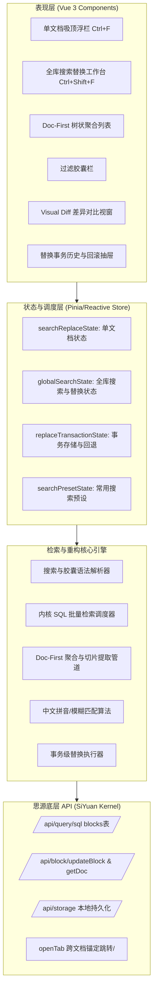
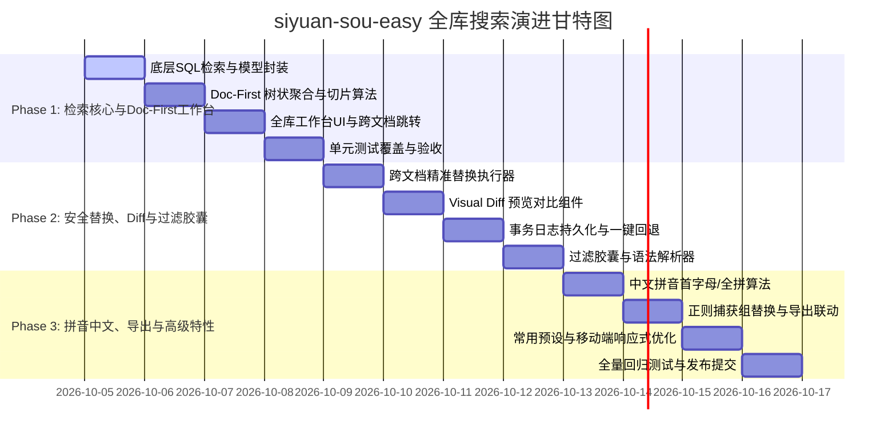

# siyuan-sou-easy 全库搜索详细设计方案与分步开发规划

> **文档状态**：已评审确认  
> **制定日期**：2026-10-05  
> **基于规划**：`docs/siyuan-search-analysis-and-sou-easy-evolution.md`  
> **目标版本**：v1.4.0 ~ v1.6.0  
> **文档定位**：全库搜索替换特性全生命周期详细设计、数据模型规范、接口契约与分步工程实施计划。

---

## 一、 背景与架构目标

### 1.1 现状与升级诉求
`siyuan-sou-easy` 目前已在单文档内实现了轻量吸顶浮栏、毫秒级响应、单字词精细替换、画布/属性视图/终端多场景适配等核心能力。然而，思源笔记原生全库搜索长期存在“居中模态强遮挡、块级原子撕裂长文上下文、替换粒度过大不可逆撤销、20+块类型过滤过载、缺乏中文拼音与移动端适配”等痛点。

本方案旨在将 `siyuan-sou-easy` 升级为**“单文档极致轻量 + 全库跨文档知识重构中枢”**的双模态利器，构建具有强竞争力的护城河。

### 1.2 核心设计原则
1. **轻量共存，拒绝遮挡**：保留单文档 `Ctrl+F` 轻量浮栏，全库检索采用侧边栏 Dock Tab（或居中工作台），实现“左侧检索、右侧联动阅读与编辑”。
2. **文档优先（Doc-First）**：以文档为第一聚合层级，智能提取关键词前后语义切片，赋予上下文呼吸空间，解决散落孤立块痛点。
3. **安全第一，绝对可控**：全库替换必须具备 Visual Diff 红绿差异对比、单项排除能力，并持久化事务历史，支持一键无损回滚。
4. **渐进过滤，开箱即用**：采用现代过滤胶囊（Pill Filters）并兼容行内语法快捷检索，降低认知负担。
5. **中文原生，体验卓越**：深度支持拼音首字母匹配、全拼检索与正则高级捕获组替换。

---

## 二、 总体架构设计



### 2.1 双模态交互设计（Dual-Mode Architecture）
- **单文档模式（In-Page Mode）**：
  - 快捷键：`Ctrl+F`（查找）、`Ctrl+R`（替换）；
  - 宿主容器：吸顶浮动悬浮条，保留当前 DOM 节点毫秒级高亮与单文档单步替换。
- **全库工作台模式（Global Vault Mode）**：
  - 快捷键：`Ctrl+Shift+F`（全局搜索替换）；
  - 宿主容器：
    - **侧边栏面板（Dock Tab）**：常驻于思源左侧或右侧停靠栏，不遮挡主编辑区；
    - **工作台弹窗（Spotlight/Drawer）**：支持独立弹窗或工作台形态，支持通过快捷键呼出与收起。
  - 跨模态联动：在全库工作台中点击某条结果，主编辑区平滑打开该文档并自动滚动高亮对应块，无缝对接单文档模式。

---

## 三、 详细功能模块设计

### 3.1 模块一：全库检索工作台与 Doc-First 树状聚合呈现

#### 1. 结果组织模型（Doc-First 两级树）
- **根节点（文档层 DocNode）**：
  - 属性：笔记本 ID/名称、文档路径（`hpath` 面包屑）、文档标题、文档最后修改时间、文档内命中总次数、折叠状态。
  - 操作：文档级一键折叠/展开、文档级批量排除/包含替换、在新标签页打开文档。
- **子节点（命中切片 MatchSnippetNode）**：
  - 属性：所在块 ID、块类型（段落、标题、代码、表格、引述等）、命中词位置、智能截取的前后 30~50 字符上下文文本、关键词高亮范围。
  - 操作：单项点击跳转并在主文档高亮、单项精细替换、展开完整块内容（+ / - 弹性呼吸空间）。

#### 2. 上下文切片提取算法（Context Slicing Algorithm）
- 针对长段落或多行内容，不直接暴力截断或仅展示单行：
  1. 定位命中文本在纯文本内容中的字符起止偏移 `[start, end]`；
  2. 向前截取至前一个标点符号（句号、问号、感叹号、换行符）或最多 40 字符；
  3. 向后截取至后一个标点符号或最多 40 字符；
  4. 生成带省略号的预览切片：`"...前文语境 [命中文本] 后文语境..."`；
  5. 用户点击展开时，动态载入该块完整 Markdown 或 DOM。

#### 3. 多维排序策略
- **相关度排序（BM25/匹配密度）**：结合标题匹配权重（文档标题命中加权）、命中频次与紧密度；
- **更新时间排序**：按文档 `updated` 倒序；
- **创建时间排序**：按文档 `created` 倒序；
- **文档篇章阅读顺序**：同一文档内按块的自然顺序（`sort`）升序排列。

---

### 3.2 模块二：渐进式过滤胶囊与即时语法解析器

#### 1. 过滤胶囊规范
| 胶囊类型 | 展现与操作 | 语法映射 |
| :--- | :--- | :--- |
| **笔记本/路径（Notebook/Path）** | 下拉选择笔记本列表，或树状文件夹单选/多选 | `notebook:笔记本名` 或 `path:/日记/2026` |
| **标签（Tags）** | 自动提取知识库高频标签，标签胶囊可点击选中/取消 | `tag:#工作` 或 `tag:待办` |
| **修改时间（Date Range）** | 快捷项：今天、近3天、近7天、近30天、自定义区间 | `updated:today`、`updated:7d` |
| **内容类型（Block Type）** | 常用4大分类：正文(p)、标题(h)、表格(t/av)、代码(c) | `type:h`、`type:code` |

#### 2. 查询语法解析器（Query Syntax Parser）
用户在全局搜索输入框键入：
```text
path:读书笔记 tag:哲学 type:h 存在主义
```
解析器将其解析为结构化过滤器对象：
```typescript
interface ParsedQuery {
  rawQuery: string
  textQuery: string          // "存在主义"
  notebook?: string
  path?: string              // "读书笔记"
  tags: string[]             // ["哲学"]
  types: string[]            // ["h"]
  updatedAfter?: number
}
```
界面上的过滤胶囊将与搜索框语法双向实时同步。

---

### 3.3 模块三：全库安全交互式替换与事务级安全中枢

#### 1. 跨文档单步跳转与精准替换
- 用户可以在全局工作台结果列表逐个按下 `Enter`，自动调用 `openTab` 打开对应文档并锚定到该块；
- 提供“替换当前并跳至下一处”快捷动作，跨文档流转校对。

#### 2. 批量替换差异预览视窗（Visual Diff Modal）
- 在点击“全部替换”时，强制弹出 Visual Diff 对比预览视窗：
  - 左侧展示变更树（按文档分组，列出所有待替换项）；
  - 右侧展示对比：原有文本（红色高亮并带删除线） vs 替换后文本（绿色高亮下划线）；
  - 每一项前提供复选框，用户可随时勾选取消某些不想替换的项；
  - 顶部展示摘要：“共影响 12 篇文档，48 处替换，已排除 3 处”。

#### 3. 事务级变更记录与一键回退（Transaction Safety Log）
- **事务批次对象（ReplaceTransaction）**：
  ```typescript
  interface ReplaceTransactionItem {
    blockId: string
    rootId: string
    originalContent: string
    newContent: string
    originalMarkdown?: string
    newMarkdown?: string
  }

  interface ReplaceTransaction {
    id: string                 // 批次唯一 UUID / 时间戳
    timestamp: number          // 执行时间
    query: string              // 当时搜索关键词
    replacement: string        // 当时替换内容
    options: SearchOptions     // 当时搜索选项
    items: ReplaceTransactionItem[]
    reverted: boolean          // 是否已被撤销回滚
  }
  ```
- **安全执行机制**：
  1. 执行前生成 Transaction Snapshot，持久化写入插件存储 `replace_transactions.json`；
  2. 分批异步写入思源内核（每批 20 块，间隔 50ms），带进度条与“取消”机制；
  3. 执行完成后弹出 Toast：“已成功替换 45 处。[一键撤销本次操作]”；
  4. 工作台侧边或设置面板提供“替换历史管理”抽屉，可查看历史批次，并随时点击“一键回退”，逆向恢复被修改的所有块。

---

### 3.4 模块四：检索算法增强与中文专属体验

#### 1. 中文拼音检索
- 支持**拼音首字母匹配**：输入 `cpjl` 命中包含 `产品经理` 的块；
- 支持**全拼匹配**：输入 `chanpin` 命中 `产品`；
- 算法优化：在初筛与高亮计算中，建立轻量拼音索引映射，计算拼音字符跨度，确保切片高亮准确落在对应的汉字上。

#### 2. 正则高级捕获组替换
- 支持 JavaScript 正则捕获组反向引用：
  - 模式：`(\d{4})-(\d{2})-(\d{2})`
  - 替换：`$1年$2月$3日`
- 支持大小写保持（Preserve Case）规则在跨文档替换中继承。

---

### 3.5 模块五：生产力导出与联动

1. **批量复制与导出为**：
   - **Markdown 链接清单**：`[文档标题](siyuan://blocks/{root_id}) - "...上下文切片..."`；
   - **思源块引用清单**：`((block_id '锚文本'))`；
   - **思源嵌入块代码**：`{{select * from blocks where id in (...)}}`。
2. **一键生成聚合笔记**：
   - 调用内核 `/api/filetree/createDocWithMd`，自动创建一篇《搜索聚合：[关键词]》文档，将所有命中项的块引用整理为大纲。
3. **常用搜索预设（Saved Searches）**：
   - 支持将当前搜索词 + 过滤胶囊命名保存为预设；
   - 在侧边栏一键点击切换执行预设。

---

## 四、 核心数据模型与接口定义

```typescript
/** 全库搜索过滤器配置 */
export interface GlobalSearchFilters {
  notebookId?: string
  pathPrefix?: string
  tags: string[]
  types: string[]           // 'p' | 'h' | 'c' | 't' | 'm' 等
  dateRange?: {
    start?: string          // YYYYMMDDHHmmss
    end?: string
  }
}

/** 命中文本切片 */
export interface MatchSnippet {
  matchId: string
  blockId: string
  rootId: string
  blockType: string
  matchedText: string
  prefixText: string
  suffixText: string
  fullContent: string
  selectedForReplace: boolean
  sort: number
  updated: string
}

/** 文档级聚合节点 */
export interface DocAggregateNode {
  rootId: string
  boxId: string
  boxName: string
  hpath: string
  docTitle: string
  updated: string
  created: string
  matches: MatchSnippet[]
  collapsed: boolean
  totalCount: number
}

/** 排序方式 */
export type GlobalSearchSortMode =
  | 'relevance'
  | 'updatedDesc'
  | 'createdDesc'
  | 'readingOrder'

/** 全库搜索全局状态 */
export interface GlobalSearchState {
  query: string
  replacement: string
  searching: boolean
  replacing: boolean
  options: {
    matchCase: boolean
    wholeWord: boolean
    useRegex: boolean
    pinyin: boolean
    fuzzy: boolean
  }
  filters: GlobalSearchFilters
  sortMode: GlobalSearchSortMode
  results: DocAggregateNode[]
  totalMatchCount: number
  totalDocCount: number
  selectedMatchId?: string
}
```

---

## 五、 分步开发实施计划（Phased Roadmap）

为了保障工程质量、测试充分性与平滑迭代，整个演进分为三大阶段实施：



### 5.1 阶段一：全库检索工作台基础搭建（v1.4.0 核心能力）
- **核心任务**：
  1. 封装思源底层 `/api/query/sql` 全库块检索查询驱动，设计多字段条件拼接与分页流。
  2. 实现 `DocFirstAggregator` 数据处理管道：按 `root_id` 进行文档分组聚合，计算上下文高亮切片。
  3. 构建全库工作台组件与视图模型，集成快捷键 `Ctrl+Shift+F`。
  4. 实现跨文档精准跳转：点击命中项调用 `openTab` 打开并高亮聚焦目标块。
  5. 编写单元测试（SQL 构建、Doc-First 聚合算法、切片截取、排序逻辑），确保测试全部通过并提交。

### 5.2 阶段二：全库安全交互式替换与过滤胶囊（v1.5.0 核心能力）
- **核心任务**：
  1. 实现全库跨文档精准替换逻辑，支持逐个替换与批量替换。
  2. 实现 Visual Diff 差异预览视窗，支持按文档/按单条高亮红绿对比与取消勾选排除。
  3. 实现事务日志持久化机制（`replace_transactions.json`）与一键撤销批次回退。
  4. 实现笔记本、标签、时间范围、块类型过滤胶囊与搜索语法解析器。
  5. 编写单元测试（差异对比生成、事务执行与回退、过滤语法解析），测试全部通过后提交。

### 5.3 阶段三：中文智能生态、高级正则与生产力导出（v1.6.0 核心能力）
- **核心任务**：
  1. 集成轻量中文拼音首字母匹配与全拼搜索算法。
  2. 实现正则捕获组（`$1, $2`）高级替换。
  3. 实现搜索结果批量导出（Markdown 双链、思源块引用、思源嵌入块）与一键生成聚合文档。
  4. 实现常用搜索预设（Saved Searches）存储与调用。
  5. 适配移动端触屏与响应式体验。
  6. 编写单元测试与全量端到端测试，验证无误后提交。

---

## 六、 测试验证策略与验收指标

### 6.1 单元测试策略
1. **算法与管道测试**：
   - 切片算法：测试单行、超长多行、包含代码块、标点边界的截取完整性；
   - 树状聚合：验证空列表、多笔记本、多文档混合场景下的分组与排序稳定性；
   - 语法解析器：验证混合语法 `path:x tag:y text` 的解析鲁棒性；
   - 事务回滚：模拟多次批量替换与逆向恢复，确保文本恢复准确率 100%。
2. **状态与 Store 测试**：
   - 测试查询状态变更、分页加载、过滤条件切换、排除列表维护。

### 6.2 质量与性能指标
- **检索响应**：全库百万字量级检索首批结果渲染时间 $\le 200\text{ms}$；
- **替换安全**：批量替换前必须提供 Diff 预览，误操作支持任意时刻一键回退；
- **代码规范**：所有代码变更通过 ESLint 校验与 TypeScript 类型检查，Vitest 测试通过率 100%。
