# siyuan-sou-easy 全库搜索详细设计方案与实施核实报告

> **文档状态**：✅ 全部实施完成（100% Completed）  
> **制定日期**：2026-10-05  
> **最新更新**：2026-10-05（完成工作台收敛合并至右侧栏 Dock 优化）  
> **基于规划**：`docs/siyuan-search-analysis-and-sou-easy-evolution.md`  
> **目标版本**：v1.4.0  
> **文档定位**：全库搜索替换特性详细设计、数据模型规范、接口契约与实际工程实施核实记录。

---

## 一、 背景与架构目标

### 1.1 现状与升级诉求
`siyuan-sou-easy` 最初在单文档内实现了轻量吸顶浮栏、毫秒级响应、单字词精细替换、画布/属性视图/终端多场景适配等核心能力。然而，思源笔记原生全库搜索长期存在“居中模态强遮挡、块级原子撕裂长文上下文、替换粒度过大不可逆撤销、20+块类型过滤过载、缺乏中文拼音与移动端适配”等痛点。

本项目将 `siyuan-sou-easy` 升级为**“单文档极致轻量 + 全库跨文档知识重构中枢”**的双模态利器，构建具有强竞争力的护城河。

### 1.2 核心设计原则（实际落地对齐）
1. **轻量常驻，拒绝遮挡**：保留单文档轻量浮栏；全库检索与替换功能**全部收敛合并至右侧栏 Dock Tab**，彻底摒弃全屏居中模态工作台遮挡主文档的弊端，实现“右侧检索、左侧联动阅读与编辑”。
2. **文档优先（Doc-First）**：以文档为第一聚合层级，智能提取关键词前后语义切片，赋予上下文呼吸空间，解决散落孤立块痛点。
3. **安全第一，绝对可控**：全库批量替换具备 Visual Diff 居中宽屏差异对比、单项/整组勾选排除能力，并持久化事务历史，支持一键无损回滚。
4. **渐进过滤，开箱即用**：采用抽屉式折叠过滤胶囊（Pill Filters）并兼容行内语法快捷检索（`path:`, `tag:`, `type:`），最大化保障侧栏检索结果垂直视野。
5. **中文原生，体验卓越**：深度支持拼音首字母匹配、全拼检索与正则高级捕获组替换。
6. **桌面专注，按端隔离**：全库搜索替换作为桌面端重度生产力功能，移动端不加载 Dock 且不响应全库快捷键，保持移动端极致轻量。

---

## 二、 总体架构设计与最新演进

```mermaid
graph TD
    subgraph UI ["表现层 (Vue 3 Components)"]
        InPageBar["单文档吸顶浮栏 (Ctrl+F11 / Ctrl+F12)"]
        GlobalDock["右侧栏 Dock: GlobalSearchDockView (Ctrl+Shift+F)"]
        DocFirstView["Doc-First 树状聚合列表 (DocAggregateItem)"]
        FilterDrawer["折叠式过滤抽屉 (FilterPillsBar + 排序选择)"]
        DiffModal["Visual Diff 差异对比视窗 (VisualDiffModal, 居中宽屏)"]
        HistoryDrawer["替换事务历史与回滚抽屉 (TransactionHistoryDrawer)"]
    end

    subgraph Store ["状态与调度层 (Pinia/Reactive Store)"]
        LocalStore["searchReplaceState: 单文档状态"]
        GlobalStore["globalSearchState: 全库搜索与替换状态"]
        DockManager["dock-manager: 侧栏展开/折叠/焦点/选区控制"]
        HistoryStore["transaction-history: 事务持久化存储与回退"]
        PresetStore["saved-presets: 常用搜索预设管理"]
    end

    subgraph Engine ["检索与重构核心引擎"]
        QueryParser["搜索与胶囊语法解析器 (query-parser)"]
        KernelSqlDriver["内核 SQL 批量检索调度器 (kernel-query)"]
        DocAggregator["Doc-First 聚合与切片提取管道 (doc-aggregator)"]
        PinyinMatcher["中文拼音首字母/全拼算法 (pinyin/engine)"]
        ReplaceEngine["事务级替换执行器 (replace-engine)"]
        DiffBuilder["差异对比构建器 (diff-builder)"]
        ExportUtils["生产力格式导出工具 (export-utils)"]
    end

    subgraph Backend ["思源底层 API (SiYuan Kernel)"]
        ApiSql["/api/query/sql (blocks 表高性能批量检索)"]
        ApiBlock["/api/block/updateBlock (块级内容原子写入)"]
        ApiStorage["/api/storage (本地持久化配置与事务历史)"]
        ApiTab["openTab (跨文档锚定跳转与高亮聚焦)"]
    end

    UI --> Store
    Store --> Engine
    Engine --> Backend
```



### 2.1 双模态交互设计落地现状
- **单文档模式（In-Page Mode）**：
  - 快捷键：`Ctrl+F11`（查找）、`Ctrl+F12`（替换，快捷键可自定义配置）；
  - 宿主容器：浮动吸顶悬浮条，保留当前 DOM 节点毫秒级高亮、选区查找与单文档单步替换。
- **全库侧栏模式（Global Dock Mode）**：
  - 快捷键：`Ctrl+Shift+F`（全局搜索与替换，快捷键可自定义配置）；
  - 宿主容器：**右侧栏 Dock 面板（`siyuan-sou-easy-dock-tab`）**，彻底取代旧版居中遮罩工作台（`GlobalSearchWorkbench.vue` 已于 2026-10-05 彻底移除）；
  - 交互体验：
    - **Toggle 开关式 + Esc 回退**：首次按下 `Ctrl+Shift+F` 自动展开侧栏并全选聚焦搜索框；若已在搜索框再次按下快捷键或按 `Esc`，自动折叠侧栏并将焦点归还主编辑器；
    - **选区智能继承**：打开侧栏时，若主编辑器有选中文字，优先填入全库搜索框；无选区则保留上次全库搜索历史词；
    - **高危操作居中审阅**：点击“批量替换预览...”唤起居中宽屏 `VisualDiffModal.vue`；点击“历史”唤起 `TransactionHistoryDrawer.vue` 抽屉。

---

## 三、 详细功能模块设计与实施核实

### 3.1 模块一：全库检索与 Doc-First 树状聚合呈现
- **实施状态**：✅ 100% 已实现并落地
- **对应文件**：
  - `src/features/search-replace/global/kernel-query.ts`
  - `src/features/search-replace/global/doc-aggregator.ts`
  - `src/features/search-replace/global/ui/GlobalSearchDockView.vue`
  - `src/features/search-replace/global/ui/DocAggregateItem.vue`

#### 1. 结果组织模型（Doc-First 两级树）
- **文档层（`DocAggregateNode`）**：
  - 聚合文档路径面包屑（`hpath`）、文档标题（`docTitle`）、更新时间、创建时间、文档内匹配总数；
  - 支持文档级独立折叠/展开、文档级批量勾选排除替换。
- **匹配切片层（`GlobalMatchSnippet`）**：
  - 记录所属块 ID、块类型（段落、标题、代码、表格、引述等）、高亮起止偏移量；
  - 智能截取前后 30~50 字符语义切片，带有弹性语境。

#### 2. 上下文切片提取与表格行精准匹配
- 算法智能向前后断句标点截取语义完整切片；
- 表格块特殊支持：在 `store.ts` 中实现 `findTargetTableRowElement` 与 `scrollAndHighlightTableRow`，跨文档或同文档跳转到表格时，精准识别目标表格行 `<tr>`，平滑居中滚动并附加黄色闪烁高亮动画。

#### 3. 多维排序策略
- 支持**相关度优先（relevance）**、**修改时间倒序（updatedDesc）**、**创建时间倒序（createdDesc）**、**路径/阅读顺序（readingOrder）**四种模式无缝切换。

---

### 3.2 模块二：渐进式过滤胶囊与即时语法解析器
- **实施状态**：✅ 100% 已实现并落地
- **对应文件**：
  - `src/features/search-replace/global/query-parser.ts`
  - `src/features/search-replace/global/ui/FilterPillsBar.vue`
  - `src/features/search-replace/global/ui/GlobalSearchDockView.vue`

#### 1. 过滤胶囊规范与侧栏抽屉化整合
- 在侧边栏 Header 提供 `⚙ 高级筛选` 按钮，点击展开/折叠高级筛选抽屉；
- 抽屉内集成笔记本下拉单选、标签筛选输入/选择、常用块类型（正文、标题、代码、表格等）选择；
- 当有筛选条件生效时，Header 的 `⚙` 图标自动显示高亮小圆点提示。

#### 2. 搜索语法即时解析
- 用户在搜索框键入：
  ```text
  path:读书笔记 tag:哲学 type:h 存在主义
  ```
- `query-parser.ts` 自动提取结构化条件，并与胶囊栏双向联动。

---

### 3.3 模块三：全库安全交互式替换与事务级安全中枢
- **实施状态**：✅ 100% 已实现并落地
- **对应文件**：
  - `src/features/search-replace/global/diff-builder.ts`
  - `src/features/search-replace/global/ui/VisualDiffModal.vue`
  - `src/features/search-replace/global/replace-engine.ts`
  - `src/features/search-replace/global/transaction-history.ts`
  - `src/features/search-replace/global/ui/TransactionHistoryDrawer.vue`

#### 1. 批量替换差异预览视窗（Visual Diff Modal）
- 侧边栏支持 `▶ / ▼` 折叠展开替换输入行；
- 点击“替换预览”触发 `buildVisualDiff`，唤起居中宽屏模态面板；
- 面板呈现红底删除线与绿底下划线直观对比，支持单项/整篇文档一键勾选排除，提供进度条和统计摘要。

#### 2. 事务日志持久化与一键撤销回退
- 替换执行器 `executeBatchReplace` 在操作前后记录完整块内容与 Markdown；
- 持久化保存至事务记录；
- 侧栏 Header 提供 `📜 历史` 入口，唤起 `TransactionHistoryDrawer`，支持查看所有历史批次并一键回滚。

---

### 3.4 模块四：检索算法增强与中文专属体验
- **实施状态**：✅ 100% 已实现并落地
- **对应文件**：
  - `src/features/search-replace/global/pinyin/dict.ts`
  - `src/features/search-replace/global/pinyin/engine.ts`
  - `src/features/search-replace/global/pinyin-match.ts`

#### 1. 中文拼音搜索
- 侧栏提供 `拼` 选项开关；
- 支持拼音首字母匹配（如 `cpjl` 命中 `产品经理`）与全拼匹配（`chanpin` 命中 `产品`）；
- 切片高亮准确映射回原中文字符。

#### 2. 正则高级捕获组替换
- 支持 `$1`, `$2` 等捕获组反向引用；
- 继承单文档大小写保持（Preserve Case）规则。

---

### 3.5 模块五：生产力导出与预设联动
- **实施状态**：✅ 100% 已实现并落地
- **对应文件**：
  - `src/features/search-replace/global/export-utils.ts`
  - `src/features/search-replace/global/saved-presets.ts`
  - `src/features/search-replace/global/ui/GlobalSearchDockView.vue`

#### 1. 批量导出菜单（`📋 导出`）
- 一键复制为 **Markdown 链接清单**（含文档双链）；
- 一键复制为 **思源块引用清单**（`((block-id 'anchor'))`）；
- 一键复制为 **思源 SQL 嵌入块**（`{{select * from blocks where id in (...)}}`）。

#### 2. 常用搜索预设（`⭐ 预设`）
- 弹窗支持将当前关键词、替换词、过滤胶囊与匹配选项命名保存；
- 预设列表支持一键载入执行与删除管理。

---

## 四、 核心数据模型与接口核实

数据模型定义在 `src/features/search-replace/global/types.ts`，实际代码与设计完全吻合：

```typescript
export interface GlobalSearchFilters {
  notebookId?: string
  pathPrefix?: string
  tags?: string[]
  types?: string[]
  dateRange?: {
    start?: string
    end?: string
  }
}

export interface GlobalMatchSnippet {
  matchId: string
  blockId: string
  rootId: string
  blockType: GlobalBlockType
  matchedText: string
  prefixText: string
  suffixText: string
  previewText: string
  segments: ContextSnippetSegment[]
  fullContent: string
  selectedForReplace: boolean
  sort: number
  updated: string
  created: string
  hpath: string
  box: string
  startOffset: number
  endOffset: number
  tableRowIndex?: number
  tableRowText?: string
  matchedCellText?: string
}

export interface DocAggregateNode {
  rootId: string
  boxId: string
  boxName?: string
  hpath: string
  docTitle: string
  updated: string
  created: string
  matches: GlobalMatchSnippet[]
  collapsed: boolean
  totalCount: number
}

export interface GlobalSearchStateModel {
  query: string
  replacement: string
  visible: boolean
  replaceVisible: boolean
  searching: boolean
  replacing: boolean
  error?: string
  statusMessage?: string
  options: {
    matchCase: boolean
    wholeWord: boolean
    useRegex: boolean
    pinyin: boolean
    fuzzy: boolean
    docOnly: boolean
  }
  filters: GlobalSearchFilters
  sortMode: GlobalSearchSortMode
  results: DocAggregateNode[]
  totalMatchCount: number
  totalDocCount: number
  selectedMatchId?: string
}
```

---

## 五、 分步开发实施计划核实情况

所有阶段的核心功能均已提前高质量实施完毕，并完成了第四阶段的工作台收敛重构：

| 阶段 | 核心任务 | 实际落地文件 | 实施状态 |
| :--- | :--- | :--- | :---: |
| **阶段一：全库检索核心与 Doc-First 呈现** | 1. 内核 SQL 全库块检索驱动<br>2. Doc-First 树状聚合与切片截取算法<br>3. 跨文档跳转与表格行精准居中高亮<br>4. 单元测试覆盖 | `kernel-query.ts`<br>`doc-aggregator.ts`<br>`DocAggregateItem.vue`<br>`tests/global-search-aggregator.test.ts`<br>`tests/global-search-table-row.test.ts` | ✅ 已完成 |
| **阶段二：安全替换、Diff 与过滤胶囊** | 1. 跨文档精准替换执行器<br>2. Visual Diff 差异对比视窗与排除勾选<br>3. 事务持久化日志与一键回退<br>4. 过滤胶囊栏与搜索语法解析器 | `replace-engine.ts`<br>`diff-builder.ts`<br>`VisualDiffModal.vue`<br>`transaction-history.ts`<br>`TransactionHistoryDrawer.vue`<br>`query-parser.ts`<br>`FilterPillsBar.vue` | ✅ 已完成 |
| **阶段三：中文生态、正则与导出联动** | 1. 中文拼音首字母与全拼搜索算法<br>2. 正则捕获组替换支持<br>3. 批量导出（Markdown/块引用/SQL）<br>4. 常用搜索预设管理与持久化 | `pinyin/engine.ts`<br>`pinyin-match.ts`<br>`export-utils.ts`<br>`saved-presets.ts`<br>`tests/global-pinyin-match.test.ts`<br>`tests/global-export-utils.test.ts` | ✅ 已完成 |
| **阶段四：架构优化——收敛合并至右侧栏 Dock** | 1. 彻底移除居中模态工作台 `GlobalSearchWorkbench.vue`<br>2. 全库功能全量迁移至 `GlobalSearchDockView.vue`<br>3. 实现 Toggle 开关式与 Esc 焦点控制<br>4. 纯桌面端隔离（移动端跳过全库功能）<br>5. i18n 与全部单元测试适配 | `GlobalSearchDockView.vue`<br>`dock-manager.ts`<br>`src/index.ts`<br>`src/App.vue`<br>`tests/global-search-dock.test.ts`<br>`src/i18n/zh_CN.json`<br>`src/i18n/en_US.json` | ✅ 已完成 |

---

## 六、 质量指标与测试验收情况

### 6.1 单元测试套件（Vitest）
* **测试用例总数**：**72 个测试文件全部通过（72/72 passed）**，**392 个用例全部通过（392/392 passed）**。
* **覆盖范围**：
  * SQL 构建与语法解析（`global-search-sql.test.ts`, `global-search-query-parser.test.ts`）；
  * 文档树聚合与切片计算（`global-search-aggregator.test.ts`, `global-search-doc-item.test.ts`）；
  * 表格行精准定位与特征打分算法（`global-search-table-row.test.ts`）；
  * Visual Diff 差异构建与排除统计（`global-diff-builder.test.ts`）；
  * 事务执行与撤销回滚（`global-transaction-history.test.ts`, `global-replace-engine.test.ts`）；
  * 中文拼音匹配算法（`global-pinyin-match.test.ts`）；
  * 导出格式化工具（`global-export-utils.test.ts`）；
  * 常用预设持久化（`global-saved-presets.test.ts`）；
  * 侧栏 Dock 挂载、折叠与替换模式交互（`global-search-dock.test.ts`）。

### 6.2 生产构建与静态类型检查
* **打包工具**：Vite 6.4.1 + vue-tsc
* **构建用时**：~950ms
* **打包产物**：
  * `dist/index.js`（285 kB，gzip 106 kB）
  * `dist/index.css`（32 kB，gzip 5.8 kB）
* **类型检查**：TypeScript 零报错，ESLint 规范 100% 达标。
