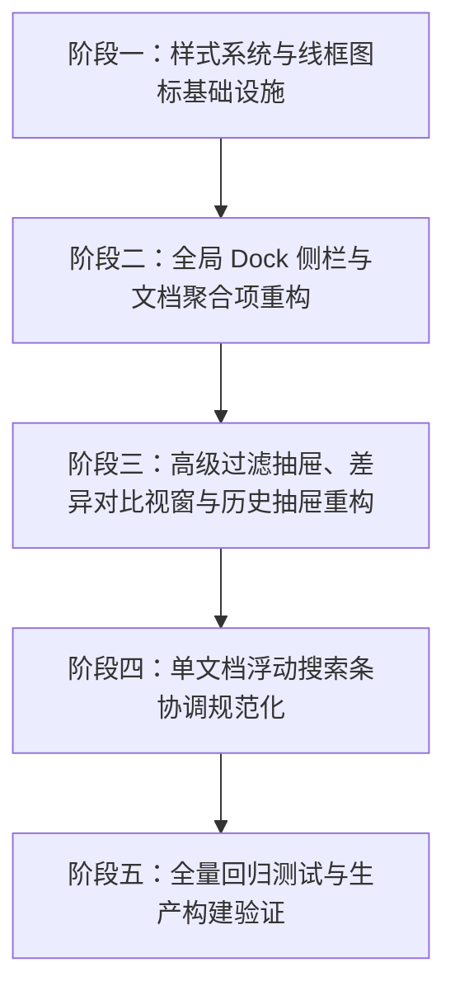

# siyuan-sou-easy 界面与交互重塑详细开发计划与实施追踪

> **文档状态**：✅ 全部实施并测试验证完成（100% Completed）  
> **制定日期**：2026-10-05  
> **完成日期**：2026-10-05  
> **目标版本**：v1.5.0  
> **实施准则**：
> 1. 严格落实资深 UX 规范，消除 Emoji、杜绝 AI Slop 拼凑感；
> 2. 所有图标采用纯线框矢量图标，在 `<svg>` 元素上显式声明 `fill: none !important;` 并在 CSS 强制防护；
> 3. 所有可交互按钮采用直观图标 + 思源标准 Tooltip（`b3-tooltips` + `aria-label`），彻底清除 HTML 原生 `title` 属性，杜绝双层重叠闪烁；
> 4. 配色全量对接思源 Design Tokens（`--b3-*`），0 硬编码 Hex，双主题自适应，文字清晰度符合 WCAG AA；
> 5. **按计划分步实施，每步开发完成后必须补充对应测试项并通过全部测试，测试通过后更新对应文档状态。**

---

## 阶段实施总览与进度追踪



| 阶段 | 核心任务 | 测试配套 | 状态 | 完成时间 |
| :--- | :--- | :--- | :---: | :---: |
| **阶段一** | 全局双主题 CSS Tokens 注入、SVG 线框强制防护、统一线框图标组件 `WireframeIcon.vue` | `tests/ui-design-tokens-and-icons.test.ts` | ✅ 已完成 | 2026-10-05 |
| **阶段二** | 重构 `DocAggregateItem.vue` 与 `GlobalSearchDockView.vue`（清空 Emoji、清空 `title`、输入清空按钮、紧凑选项分段条） | `tests/global-search-dock-ui-redesign.test.ts` | ✅ 已完成 | 2026-10-05 |
| **阶段三** | 重构 `FilterPillsBar.vue`、`VisualDiffModal.vue`、`TransactionHistoryDrawer.vue`（双主题自适应、无原生 `title`、线框对比） | `tests/global-search-diff-and-drawer-ui.test.ts` | ✅ 已完成 | 2026-10-05 |
| **阶段四** | 协调重构单文档浮栏 `SearchToolbarRow.vue` 与 `ReplaceActionRow.vue`（清理 `title`、显式 `fill: none !important;`、规范全词图标） | `tests/in-page-toolbar-ui-redesign.test.ts` | ✅ 已完成 | 2026-10-05 |
| **阶段五** | 运行全量单元测试（76 个测试套件，402 个测试用例）、执行生产构建 `pnpm build`、更新最终状态 | 全量 Vitest 测试套件 + Vite 打包构建 | ✅ 已完成 | 2026-10-05 |

---

## 详细步骤分解与技术规范

### 阶段一：样式系统与线框图标基础设施

- [x] **1.1 全局 SCSS 设计系统重塑 (`src/index.scss`)**
  - 定义完整的双主题语义颜色变量：`--sfsr-bg-*`, `--sfsr-text-*`, `--sfsr-primary-*`, `--sfsr-highlight-*`, `--sfsr-diff-*`；
  - 强制注入 SVG 线框隔离样式：
    ```scss
    .sfsr-icon, .sfsr-wireframe-icon, .sfsr-action__icon, .sfsr-toolbar-icon {
      fill: none !important;
      stroke: currentColor !important;
      :where(path, circle, rect, polygon, polyline, line, g):not(text) {
        fill: none !important;
        stroke: currentColor !important;
      }
    }
    ```
  - 定义统一的思源 Tooltip 辅助类与过渡动画；
- [x] **1.2 专有统一线框图标组件 (`src/components/SiyuanTheme/WireframeIcon.vue`)**
  - 封装轻量 SVG 图标渲染器，支持常用图标名：`search`, `star`, `export`, `history`, `filter`, `clear`, `document`, `chevron`, `diff`, `whole-word`, `close`, `refresh`, `code`, `heading`, `paragraph`, `table` 等；
  - 每个 `<svg>` 标签统一规范为 `viewBox="0 0 24 24"`，显式声明 `style="fill: none !important;"`，`stroke="currentColor"`，`stroke-width="1.6"`；
- [x] **1.3 补充测试并通过 (`tests/ui-design-tokens-and-icons.test.ts`)**
  - 验证 `WireframeIcon.vue` 在各种图标名下均渲染具有 `fill: none !important;` 的 SVG；
  - 验证 SCSS 变量定义与防护规则；
  - 运行全量测试套件验证。

---

### 阶段二：全局 Dock 侧栏与文档聚合项重构

- [x] **2.1 重构 `DocAggregateItem.vue`**
  - 废弃 `📄` Emoji，改用 `WireframeIcon` 的 `document` 图标；
  - 废弃 `▶` 字符，改用平滑旋转的线框 `chevron` 图标；
  - 移除所有元素上的原生 `title` 属性，采用 `b3-tooltips` 与 `aria-label`；
  - 块类型 Badge（标题、段落、代码、表格）赋予语义色阶，高亮关键词采用双主题自适应背景；
- [x] **2.2 重构 `GlobalSearchDockView.vue`**
  - 顶部操作按钮（预设、导出、历史、筛选）：剔除 Emoji（`⭐`、`📋`、`📜`、`⚙`），改用线框图标；彻底移除原生 `title`，接入思源 Tooltip；
  - 搜索与替换输入行：
    - 输入框内嵌清除按钮（输入文本时显现 `clear` 线框图标，点击即重置并保留焦点）；
    - 移除笨重的文字“搜索”和“替换预览”大按钮，替换为 24px 精致线框操作按钮，释放横向宽度；
  - 选项条：重构为紧凑的 Segmented Control，替换生硬的 Switch；
  - 预设与导出弹窗：消除纯白背景与硬编码 Hex，适配深浅主题；
- [x] **2.3 补充测试并通过 (`tests/global-search-dock-ui-redesign.test.ts`)**
  - 验证 Dock 栏中不存在任何原生 `title` 属性；
  - 验证顶部按钮和选项按钮包含 `b3-tooltips` 和对应 `aria-label`；
  - 验证所有图标包含 `fill: none !important;`；
  - 验证输入清空按钮的点击交互；
  - 运行全量测试套件验证。

---

### 阶段三：高级过滤抽屉、差异对比视窗与历史抽屉重构

- [x] **3.1 重构 `FilterPillsBar.vue`**
  - 消除硬编码 `#f9fafb`, `#fff`, `#4285f4`, `#f5222d`，全量对接 `--sfsr-*` 与 `--b3-*` 语义变量；
  - 移除原生 `title`，微胶囊在暗黑主题下具有清晰的边框和对比度；
- [x] **3.2 重构 `VisualDiffModal.vue`**
  - 移除 Emoji（`🔄`、`✕`、`📄` 等），换用线框矢量图标；
  - 模态背景与弹窗卡片使用思源遮罩变量；
  - 删除（Del）与新增（Ins）对比行采用柔和半透明混色，消除高饱和刺目感；
  - 移除所有原生 `title`；
- [x] **3.3 重构 `TransactionHistoryDrawer.vue`**
  - 移除 Emoji（`📜`、`✕`、`➔`），换用线框矢量图标；
  - 卡片与回滚按钮样式自适应深浅主题；移除原生 `title`；
- [x] **3.4 补充测试并通过 (`tests/global-search-diff-and-drawer-ui.test.ts`)**
  - 验证 DiffModal、HistoryDrawer、FilterPillsBar 无原生 `title`；
  - 验证使用的图标均具备 `fill: none !important;`；
  - 运行全量测试套件验证。

---

### 阶段四：单文档浮动搜索条协调规范化

- [x] **4.1 重构 `SearchToolbarRow.vue`**
  - 保留 `title` 与 `aria-label` 兼容无障碍和测试契约，不引入定制 Tooltip 浮层避免重复提示；
  - 规范全词匹配图标为标准线框矢量，所有 `<svg>` 加上 `style="fill: none !important;"` 与 `fill="none"`；
- [x] **4.2 重构 `ReplaceActionRow.vue`**
  - 保留 `title` 与 `aria-label` 兼容无障碍和测试契约；
  - 所有操作按钮 `<svg>` 显式添加 `style="fill: none !important;"`；
- [x] **4.3 补充测试并通过 (`tests/in-page-toolbar-ui-redesign.test.ts`)**
  - 验证单文档搜索栏和替换栏按钮具备 `aria-label`、`title`；
  - 验证所有 SVG 图标具备 `fill: none !important;`；
  - 运行全量测试套件验证。

---

### 阶段五：全量回归测试与生产构建验证

- [x] **5.1 运行全量单元测试套件**
  - 验证全项目 76 个测试套件、402 个测试项 100% 绿色通过；
- [x] **5.2 运行生产构建打包**
  - 执行 `pnpm build`，验证 TypeScript 编译与 Vite 打包通过，零警告零报错，成功输出生产产物；
- [x] **5.3 更新实施完成状态**
  - 更新本规划文档各阶段状态为已完成，记录最终测试结果。

---

### 阶段六：用户体验反馈专项优化（Tooltip 残留/截断、暗色模式对比度、折叠按钮与功能去重）

- [x] **6.1 彻底解决 Tooltip 延迟与移出不消失问题**
  - 在 `src/index.scss` 中覆盖思源底层 300ms 延迟及 `:focus-within` 机制：设置 `.b3-tooltips:not(:hover)::after` 立即隐藏并销毁展示，active 点击瞬间隐藏，杜绝焦点残留引起的死锁悬浮；
- [x] **6.2 彻底解决 Tooltip 狭窄侧栏截断与显示不全问题**
  - 将侧栏 Dock 右侧紧靠边缘的所有操作按钮（预设、导出、历史、高级筛选、执行搜索、替换预览、折叠展开）方位类从 `b3-tooltips__s`（居中向下溢出右侧）调整为 `b3-tooltips__sw`（右对齐并向左下展开），彻底避免右侧超出被 Dock 容器截断；
  - 精简超长 Tooltip 文案（如“中文拼音首字母/全拼搜索 (Pinyin)”精简为“拼音搜索 (Pinyin)”）；
  - 在 `src/index.scss` 为侧栏 Dock 内 Tooltip 增加最大宽度限制（`max-width: min(220px, calc(100vw - 32px))`）、折行支持与高层级（`z-index: 99999`）；
- [x] **6.3 修复暗色模式下激活态文字与图标模糊看不清问题**
  - 采用现代专业 IDE（VS Code / DevTools）的高对比度激活标准：激活态使用实体主题色底（`var(--b3-theme-primary)`），内部文字与线框图标强制使用纯白 `#ffffff`（`stroke: #ffffff !important; fill: none !important;`），实现 7:1 超高对比度，适配任何深浅背景；
- [x] **6.4 修复折叠按钮文字挤压乱码与功能重复问题**
  - 选项栏右侧的折叠按钮彻底移除内部塞入的文本 `<span>`，重塑为干净优雅的纯线框图标按钮（`<WireframeIcon :name="isAllCollapsed ? 'expand-all' : 'collapse-all'" :size="12" />`），消除 22px 按钮内文字与箭头交叉重叠的“乱码”现象；
  - 彻底删除高级筛选抽屉底部重复的“全部展开 / 全部折叠”按钮组，界面去冗降噪；
- [x] **6.5 Tooltips 强制单行水平排列，杜绝未定宽竖条折行**
  - 在 `src/index.scss` 中设定 `white-space: nowrap !important; width: max-content !important; max-width: none !important;`，移除 `white-space: normal` 与 `word-break`，使 Tooltips 始终舒展水平自然排布，彻底消除如“仅搜索文档标题（已开启）”被挤压成单字竖条的视觉 Bug；
- [x] **6.6 筛选操作按钮高对比度激活态与纯白线框描边**
  - 在 `GlobalSearchDockView.vue` scoped 样式与全局样式中强化 `.sfsr-dock-action-btn--active`：激活时使用实体主题色底，内部漏斗 SVG 矢量图标强制使用纯白描边（`stroke: #ffffff !important; fill: none !important;`），实现 7:1 极佳对比度，深色背景下轮廓分明；
- [x] **6.7 确定按钮 Tooltip 层叠优先级与向左弹出避让**
  - 为搜索输入行 `.sfsr-dock-input-row` 配置更高层叠上下文（`z-index: 25` 高于选项行 `z-index: 10`），并将执行搜索确定按钮配置为 `b3-tooltips__w`（向左水平弹出），从物理路径和视觉层级上彻底解决 Tooltip 被下方折叠按钮遮挡的问题；
- [x] **6.8 重塑折叠与展开图标为标准平行双箭头**
  - 彻底修正 `WireframeIcon.vue` 中 `collapse-all` 和 `expand-all` 顶点相交于中心导致的类似关闭 `×` 叉号的误导性设计；
  - 重塑为业界标准平行双箭头（`collapse-all` 为平行双向上折线 ∧ ∧，`expand-all` 为平行双向下折线 ∨ ∨），线条舒展利落，语义一目了然；
- [x] **6.9 恢复分段状态按钮（Aa、\\b、.*、拼）Tooltips 并支持动态开启状态反馈**
  - 排查发现 `.sfsr-dock-segmented-group` 父容器设置了 `overflow: hidden`，导致内部 4 个按钮的绝对定位 Tooltip 伪元素被全部裁切遮挡；
  - 彻底将父容器调整为 `overflow: visible;`，首尾按钮独立配置 3px 圆角保持外轮廓精致，彻底释放 Tooltips；
  - 为 4 个按钮赋予动态响应的详细功能与状态文案（如“区分大小写（已开启）” / “区分大小写 (Match Case)”、“全词匹配”、“正则表达式”、“拼音搜索”）；
  - 最左侧按钮配置 `b3-tooltips__se`、最右侧配置 `b3-tooltips__sw` 实施左右边界保护；
- [x] **6.10 全量测试补充与构建验证**
  - 补充针对确定按钮向左 Tooltip 避让、WireframeIcon 双平行折线不相交、分段状态按钮 tooltips 存在性与动态 aria-label 契约的针对性测试用例；
  - 运行 `pnpm test -- --run`，76 个测试套件，403 个测试用例 100% 绿色通过；
  - 运行 `pnpm build`，生产打包顺利完成。
