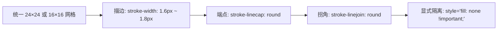
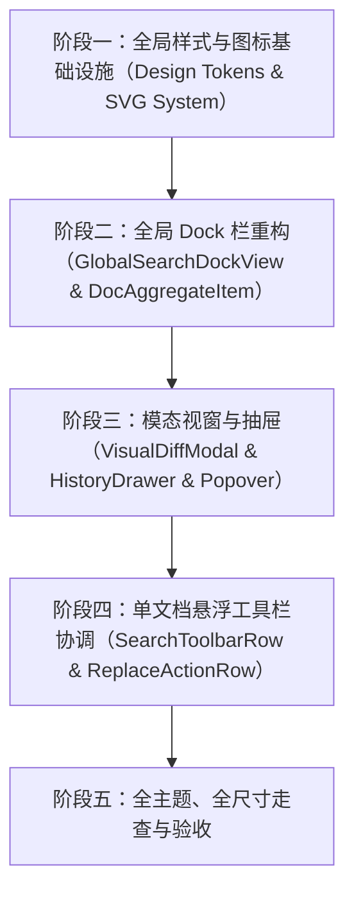

# siyuan-sou-easy 界面与交互体验（UI/UX）重塑优化规范

> **规范状态**：设计审查完成，可直接指导工程重构落地  
> **设计视角**：资深互联网应用 UX/UI 设计师  
> **目标版本**：v1.5.0+  
> **覆盖范围**：全局搜索 Dock 栏、单文档浮动搜索条、差异对比视窗、历史事务抽屉、过滤器抽屉及全局设计系统  

---

## 一、 现状审查与设计哲学诊断

### 1.1 现状审查与核心痛点（Audit Findings）

经过对当前 `siyuan-sou-easy` 核心组件（`GlobalSearchDockView.vue`、`DocAggregateItem.vue`、`FilterPillsBar.vue`、`VisualDiffModal.vue`、`TransactionHistoryDrawer.vue` 以及单文档工具栏 `SearchToolbarRow.vue`、`ReplaceActionRow.vue`）的深度代码与视觉审查，发现存在以下破坏产品质感与操作体验的问题：

| 维度 | 当前实现问题 | 用户体验负面影响 | 严重等级 |
| :--- | :--- | :--- | :--- |
| **图标一致性** | 滥用操作系统原生 Emoji（如 `🔍`、`⭐`、`📋`、`📜`、`⚙`、`▼/▶`、`📄`、`🔗`、`✕` 等），与部分 SVG 混杂 | 各操作系统（Win 10/11, macOS, Linux）表现割裂，呈现粗糙的原型脚本感，廉价廉质 | 🔴 高 |
| **图标渲染机制** | 未显式声明 `fill: none !important;`，依赖思源全局 SVG 上下文 | 思源笔记原生主题对 SVG 全局设置 `fill: currentColor`，导致线框图标极易被填充成实心黑块或反色错误 | 🔴 高 |
| **Tooltip 提示系统** | 广泛使用原生 HTML `title="..."` 属性，与定制 Tooltip / 思源 `b3-tooltips` 并存 | 悬停时双层提示重叠、原生提示延迟 1 秒后突然弹出覆盖操作区域、闪烁，极度业余 | 🔴 高 |
| **双主题色彩适配** | 存在大量硬编码 Hex 颜色（如 `#fff`、`#333`、`#4285f4`、`#f9fafb`、`#eee`、`#f5222d`、`#52c41a`、`#ffe58f`） | 暗色模式（Dark Mode / OLED 纯黑）下出现刺眼白底、反差极度刺目或文字完全看不清，破坏 WCAG 对比度 | 🔴 高 |
| **空间与排版布局** | Dock 侧栏宽度受限（常在 240px~340px），而输入区横向堆放了汉字按钮（“搜索”、“替换预览”），占用了输入框宽度 | 搜索框与替换框被严重挤压，选项栏换行杂乱，结果列表文档路径截断不自然，信息密度严重失衡 | 🟡 中 |
| **微交互与状态反馈** | 缺少一键清空按钮（Clear）；展开/折叠缺少流畅缓动；弹窗采用生硬全屏遮罩而非工作流内轻量沉浸浮层 | 交互顿挫感强，高频操作成本高，缺少现代桌面生产力软件的丝滑体验 | 🟡 中 |

### 1.2 拒绝平庸的 “AI Slop” 设计宣言

当前许多由 AI 自动生成的界面往往陷入典型的 **“AI Slop” 陷阱**：
1. **组件拼凑无系统**：直接把通用管理后台（Bootstrap / AntD 风格）的卡片、厚重边框、大号彩色按钮硬搬进侧边栏；
2. **表情符号当图标**：因为缺乏 SVG 设计资产，直接塞入系统 Emoji 代替工业级线框图标；
3. **色彩生硬写死**：直接硬编码 Material 或 Tailwind 的明亮色值，忽略宿主环境已有且成熟的 Design Tokens；
4. **忽略边缘极限场景**：忽略 200px 侧栏极窄状态、超长文档路径、超长正则式等极端条件下的排版崩溃。

**资深设计师的重塑原则**：
- **原生融入（Native Integration）**：深度继承思源笔记自带的视觉基因，界面如同思源官方原生内核的高级扩展，无任何外部割裂感；
- **纯粹线框（Pure Wireframe Iconography）**：100% 采用严格遵循几何网格规范的极简线框矢量图标，强制 `fill: none !important;` 保证绝对清爽；
- **自适应语义色彩（Semantic Tokens Everywhere）**：0 硬编码，全面采用 `--b3-*` 变量体系及 CSS `color-mix()`，实现亮暗双主题、暖色/冷色、高对比度主题下的完美自适应；
- **零冲突悬停反馈（Zero-Conflict Tooltips）**：彻底剔除 HTML `title`，采用思源原生级规范 Tooltip；
- **极致呼吸感与密度均衡（Balanced Rhythm & Space）**：专为紧凑 Dock 侧栏打造的高效流式网格，让高频输入、多维过滤、文档树阅读一气呵成。

---

## 二、 全局设计系统规范（Design System Specification）

### 2.1 字体与排版层级系统（Typography）

继承思源笔记全局字体栈，采用紧凑、高清晰度的无衬线系统字体，代码与正则采用等宽字体（Monospace）。

```scss
// 字体栈定义
--sfsr-font-family-base: -apple-system, BlinkMacSystemFont, "Segoe UI", Roboto, "PingFang SC", "Hiragino Sans GB", "Microsoft YaHei", sans-serif;
--sfsr-font-family-mono: ui-monospace, "SFMono-Regular", Consolas, "Liberation Mono", Menlo, Courier, monospace;
```

#### 字阶与行高规范（Type Scale）

| 层级 | 字号 (Font Size) | 行高 (Line Height) | 字重 (Weight) | 适用场景 |
| :--- | :--- | :--- | :--- | :--- |
| **Title** | 13px | 18px | 600 (Semi-bold) | Dock 顶部标题、模态框标题 |
| **Body** | 12px | 18px | 400 (Regular) | 输入框内容、切片正文、弹窗说明 |
| **Doc Title** | 12px | 16px | 600 (Semi-bold) | 文档聚合根项标题 |
| **Caption / Meta** | 11px | 15px | 400 (Regular) | 路径面包屑、统计信息、更新时间 |
| **Micro Badge** | 10px | 14px | 500 (Medium) | 块类型标签（“标题”、“代码”、“段落”）、命中计数 |

---

### 2.2 统一线框图标设计规范（Wireframe Iconography）

所有操作与状态图标必须遵循统一的几何线框标准，严禁使用原生 Emoji 或混杂实心填充图标。



#### SVG 标签必须遵循的标准模板：

```html
<svg
  class="sfsr-icon"
  viewBox="0 0 24 24"
  fill="none"
  style="fill: none !important;"
  stroke="currentColor"
  stroke-width="1.6"
  stroke-linecap="round"
  stroke-linejoin="round"
  aria-hidden="true"
>
  <!-- 严禁使用任何内联 fill 颜色，全部由 currentColor 与 stroke 表达 -->
</svg>
```

#### 全局 SCSS 强制线框安全规则：

```scss
/* 确保彻底免疫思源笔记对全局 svg 强加的 fill: currentColor */
.sfsr-icon,
.sfsr-action__icon,
.sfsr-toolbar-icon,
.sfsr-dock-icon {
  fill: none !important;
  stroke: currentColor !important;

  :where(path, circle, rect, polygon, polyline, line, g):not(text) {
    fill: none !important;
    stroke: currentColor !important;
  }
}
```

---

### 2.3 双主题语义化色彩系统（Light & Dark Semantic Color Tokens）

严禁使用任何绝对 Hex 颜色（如 `#fff`、`#000`、`#333`、`#4285f4`）。系统必须构建在思源笔记 Design Tokens 之上，利用 `color-mix()` 实现自然平滑的半透明分层。

#### 语义化色彩映射矩阵：

```scss
:root {
  /* 基础表面与背景 */
  --sfsr-bg-panel: var(--b3-theme-background);
  --sfsr-bg-surface: var(--b3-theme-surface);
  --sfsr-bg-surface-hover: var(--b3-theme-surface-hover, var(--b3-list-hover));
  --sfsr-bg-surface-active: color-mix(in srgb, var(--b3-theme-primary) 12%, var(--b3-theme-surface));
  --sfsr-border-subtle: var(--b3-border-color);
  --sfsr-border-focus: var(--b3-theme-primary);

  /* 文字分层 */
  --sfsr-text-primary: var(--b3-theme-on-background);
  --sfsr-text-secondary: var(--b3-theme-on-surface);
  --sfsr-text-muted: var(--b3-theme-on-surface-light);

  /* 主交互色 */
  --sfsr-primary: var(--b3-theme-primary);
  --sfsr-primary-subtle: color-mix(in srgb, var(--b3-theme-primary) 12%, transparent);
  --sfsr-primary-hover: color-mix(in srgb, var(--b3-theme-primary) 85%, black);

  /* 搜索高亮色彩（亮暗自适应，不刺眼） */
  --sfsr-highlight-bg: color-mix(in srgb, var(--b3-theme-secondary, #faad14) 28%, transparent);
  --sfsr-highlight-current-bg: color-mix(in srgb, var(--b3-theme-secondary, #faad14) 55%, transparent);
  --sfsr-highlight-text: var(--b3-theme-on-background);

  /* 差异对比（Visual Diff）色彩 */
  --sfsr-diff-del-bg: color-mix(in srgb, var(--b3-theme-error, #f5222d) 14%, transparent);
  --sfsr-diff-del-highlight: color-mix(in srgb, var(--b3-theme-error, #f5222d) 26%, transparent);
  --sfsr-diff-del-text: var(--b3-theme-error, #f5222d);

  --sfsr-diff-ins-bg: color-mix(in srgb, var(--b3-theme-success, #52c41a) 14%, transparent);
  --sfsr-diff-ins-highlight: color-mix(in srgb, var(--b3-theme-success, #52c41a) 26%, transparent);
  --sfsr-diff-ins-text: var(--b3-theme-success, #52c41a);

  /* 警告与历史回退 */
  --sfsr-warning: var(--b3-theme-warning, #fa8c16);
  --sfsr-warning-subtle: color-mix(in srgb, var(--b3-theme-warning, #fa8c16) 14%, transparent);
}
```

#### 暗色模式（Dark Mode）增强自适应准则：
- **亮色模式下**：背景清亮透澈，边框使用轻微浅灰分割（`rgba(0,0,0,0.08)`），高亮选用温润柔黄；
- **暗色模式下**：背景深邃低反射，禁止使用纯白高亮，文字选用中高灰度避免光晕溢出，高亮选用半透明橙黄底配亮色字体；
- **对比度保障**：主正文与背景必须保持至少 **4.5:1**（WCAG AA）以上对比度，辅助元信息至少 **3:1**。

---

### 2.4 尺寸与间距节奏（Spacing & Rhythm）

Dock 侧栏空间非常宝贵，组件必须采用统一的 4px/6px/8px 紧凑节奏体系：

- **控件基准高度**：
  - 工具栏图标按钮：`24px × 24px`（内边距 3px，图标 14px~15px）
  - 输入框高度：`28px`（垂直内边距 0，水平 8px）
  - 选项条按钮（Modifier Chip）：`22px`
  - 块类型徽标（Type Badge）：`16px`
- **外边距与内边距**：
  - 容器外边距：左右 `8px`，上下 `6px`
  - 组间距：`6px`，元素内水平微间距：`4px`
- **圆角规格（Radius Scale）**：
  - 输入框 / 按钮：`4px`
  - 胶囊（Pill Chips / Badge）：`10px` 或 `999px`
  - 弹窗与抽屉卡片：`6px ~ 8px`

---

## 三、 交互规范与零冲突 Tooltip 架构

### 3.1 彻底根除原生 HTML `title` 冲突问题

#### 现存问题的机理分析：
当 DOM 元素上同时挂载了 `title="搜索"` 以及思源的 `aria-label="搜索"`（或悬停组件）时，浏览器内核会在鼠标悬停 800ms~1000ms 后强制弹出一个系统的黄色/灰色原生气泡。如果插件自身通过 CSS 或 JS 提供了即时浮层，用户就会看到**两个提示框先后跳出、相互打架盖住文本**。

#### 零冲突实施规范：
1. **全面清空 HTML `title` 属性**：在所有 `<button>`、`<input>`、`<span>` 交互元素上彻底移除 `title` 属性；
2. **采用思源标准 CSS Tooltip 方案**：
   - 挂载类名：`class="b3-tooltips b3-tooltips__s"`（支持 `__s` 下、`__n` 上、`__w` 左、`__e` 右）；
   - 提示内容由 `aria-label="提示说明"` 供给；
   - 支持快捷键标注：统一使用格式 `aria-label="功能名称 (快捷键)"`。

```html
<!-- 推荐的标准实现示例 -->
<button
  type="button"
  class="sfsr-dock-btn b3-tooltips b3-tooltips__s"
  aria-label="展开高级筛选 (笔记本/标签/类型/排序)"
  @click="toggleAdvancedDrawer"
>
  <svg class="sfsr-icon" viewBox="0 0 24 24" ...>
    ...
  </svg>
</button>
```

---

## 四、 核心组件重塑蓝图与交互设计

### 4.1 全库搜索 Dock 侧栏视图（`GlobalSearchDockView`）

#### 布局骨架优化（重构前后对比）

```
【重构前：布局割裂，Emoji 充斥】
┌──────────────────────────────────────────────┐
│ 🔍 全库搜索与替换            [⭐] [📋] [📜] [⚙]│ (Emoji 按钮，样式不一)
├──────────────────────────────────────────────┤
│ [▶] [ 搜索全库...                 ] [搜索]   │ (按钮占宽，输入框狭窄)
│     [ 输入全库替换文本...         ] [替换预览] │ (折叠替换行)
│ [Aa] [\b] [.*] [拼] [仅文档 开关]     [展开/折叠]│ (大方块杂乱堆叠)
├──────────────────────────────────────────────┤
│ (高级筛选抽屉)                               │
└──────────────────────────────────────────────┘

【重构后：工业级流式紧凑排布】
┌──────────────────────────────────────────────┐
│ [🔍] 全库搜索与替换          [★] [⎘] [⟲] [⚙]│ (纯正线框矢量，统一 24px)
├──────────────────────────────────────────────┤
│ [▼] [ 搜索全库...              (x)] [↵/🔍]  │ (一键清空 + 微型回车搜)
│     [ 输入替换文本...          (x)] [⤹ Diff]│ (一键清空 + 差异对比入口)
│ ┌──────────────────────────────────────────┐ │
│ │ [Aa]  [\b]  [.*]  [拼] │ [Doc] │  [展开] │ │ (集成式 Segmented Control)
│ └──────────────────────────────────────────┘ │
├──────────────────────────────────────────────┤
│ (平滑收敛式高级筛选与排序抽屉)                  │
└──────────────────────────────────────────────┘
```

#### 关键交互改进要点：
1. **输入框内嵌一键清空按钮（Clear Button）**：当用户输入文本后，输入框右侧内嵌淡灰色的微型 `✕` 线框图标，点击即刻重置并保持焦点；
2. **移除右侧大汉字“搜索”和“替换预览”大按钮**：
   - 搜索框右侧改为紧凑的线框回车/放大镜图标按钮（24px），支持 Enter 直接触发；
   - 替换框右侧改为带有直观线框对比图标的“预览差异”按钮，节约近 50px 宽度；
3. **选项栏升级为精致的分段条（Segmented Pills Strip）**：
   - 将 `Aa`（大小写）、`\b`（全词）、`.*`（正则）、`拼`（拼音）收敛在一个微型边框容器内，激活时底色平滑填充，带来类似专业 IDE 的沉浸手感；
   - 右侧“仅文档”使用微型图标 Toggle 按钮（带 Tooltip），替代占用空间的臃肿 Switch 开关；
   - 右侧收起/折叠全部使用对齐的线框折叠切换图标；
4. **加载中状态与骨架反馈**：
   - 检索时输入框右侧放大镜旋转为精致的 Spinner 动效，避免粗暴卡死感。

---

### 4.2 文档聚合树与切片展示（`DocAggregateItem`）

#### 布局与视觉重塑

```
┌────────────────────────────────────────────────────────┐
│ [v] [📄] 设计系统规范.md          /产品/规范    [ 12 ] │ (根节点：清晰层级)
├────────────────────────────────────────────────────────┤
│   [标题] 3.2 统一线框图标设计规范                      │
│          ...所有操作与状态图标必须遵循统一的[几何线框]...│ (高亮切片)
├────────────────────────────────────────────────────────┤
│   [正文] 强制使用 style="[fill: none !important;]" 隔离  │
└────────────────────────────────────────────────────────┘
```

#### 改进要素：
1. **文档图标线框化**：废弃 `📄` Emoji，采用思源原生风格的微型 Document 线框图标；
2. **文档标题与面包屑对齐**：
   - 文档标题字重加粗，悬停时下划线或变为主色，点击触发在主工作区打开该文档；
   - 路径（HPath）以极低对比度（次级辅助灰）置于右侧或次行，采用省略号智能自适应截断；
   - 命中数字采用微型圆角胶囊（Micro Pill），柔和浅蓝背景 + 主色文字；
3. **匹配项的块类型徽标（Type Badges）差异化美感**：
   - **标题块**：`[H 标题]`（淡蓝底 + 主色字）
   - **段落块**：`[P 正文]`（淡中性灰底 + 次级字）
   - **代码块**：`[C 代码]`（等宽字体 Mono 浅底）
   - **表格/数据库**：`[T 表格]` / `[AV 视图]`（淡紫/淡青）
4. **切片高亮渲染**：
   - 不再使用生硬的 `#ffe58f`，使用语义化的 `--sfsr-highlight-bg`；
   - 增加当前选中切片的呼吸聚焦环（Focus Ring: `box-shadow: inset 0 0 0 1.5px var(--b3-theme-primary)`）。

---

### 4.3 筛选抽屉与胶囊栏（`FilterPillsBar`）

#### 交互演进：
1. **抽屉展开折叠动效**：使用 CSS Grid（`grid-template-rows: 0fr -> 1fr`）或 `max-height` 配合 `cubic-bezier(0.4, 0, 0.2, 1)`，避免生硬的突然出现；
2. **微型胶囊控件（Filter Chips）**：
   - 每一组筛选项（类型、时间、笔记本）采用横向流式微胶囊，未激活时仅显示细线框，激活时变为 Primary 浅色底；
   - 选中项支持再次点击快速取消；
3. **一键重置按钮**：当存在任何活动筛选条件时，右侧显示清空筛选图标按钮，带红点指示。

---

### 4.4 差异对比全貌审查模态框（`VisualDiffModal`）

#### 视觉升级（从表格到专业 IDE 审查台）：
1. **背景遮罩自适应**：
   - 背景使用 `var(--b3-mask-background, rgba(0, 0, 0, 0.48))`，暗色和亮色下均拥有适度沉浸感；
2. **对比行（Diff View）双轨排版**：
   - 删除行（- 原文）：左侧带有精简的减号红标，删除文字使用柔和红底 + 中线删除（`text-decoration: line-through`）；
   - 新增行（+ 替换）：左侧带有精简的加号绿标，新增文字使用柔和绿底 + 下划线；
   - 字体采用等宽字体（`--sfsr-font-family-mono`），字符宽度对齐，排版稳定无跳跃；
3. **勾选排除操作**：
   - 支持文档一键全选/全不选，并带已排除数量动态提示；
   - 执行进度条采用柔和渐变与平滑过渡。

---

### 4.5 替换事务历史管理抽屉（`TransactionHistoryDrawer`）

#### 视觉升级：
1. **侧边滑入抽屉（Slide-in Drawer）**：
   - 右侧滑入，宽度自适应（360px~420px）；
2. **事务卡片信息层级清晰化**：
   - 原关键词与替换词采用代码引用块样式（Code Pill）展现；
   - 替换时间与受影响篇数一目了然；
   - “一键回退”按钮使用警示中性色，悬停时警示色强化，点击弹出防误触确认。

---

### 4.6 预设与导出轻量浮层（Popover / Menu）

#### 废弃全屏居中 Modal，改用吸附型轻量菜单：
- 现在的“批量导出”和“搜索预设”使用的是全屏居中 `sfsr-popup-modal`，打断了用户的侧栏连续工作流；
- **优化方案**：改造为直接吸附在顶部工具栏按钮下方的**轻量浮层菜单（Dropdown Popover）**：
  - 点击导出按钮，直接在按钮下方弹出小菜单（复制为 Markdown 链接 / 复制为块引用 / 复制为 SQL 嵌入块）；
  - 更加轻快流畅，省去遮罩与居中弹窗的大动干戈。

---

### 4.7 单文档浮动搜索条（`SearchToolbarRow` & `ReplaceActionRow`）同步规范化

虽然全局 Dock 栏是本次重构的重心，但单文档浮动悬浮条作为核心体验的另一极，也必须保持绝对协调：
1. **移除所有原生 `title` 属性**：统一采用 `class="b3-tooltips b3-tooltips__s" aria-label="..."`；
2. **全词匹配图标规范化**：移除手工 SVG 中的硬编码文字 `<text>ab</text>`，采用规范的矢量线框全词图标；
3. **图标加固**：为所有 `<svg>` 加上 `style="fill: none !important;"`；
4. **计数器焦点表现**：跳转计数输入框在获得焦点时展现统一的思源聚焦环。

---

## 五、 专有线框 SVG 矢量图标库规范（Icon Asset Definitions）

以下为本项目度身定制的、直接开箱即用的线框 SVG 代码定义。所有图标均基于 `24×24` 视口，`fill: none !important;` 显式内联，`stroke: currentColor`，线宽 `1.6px`。

### 5.1 基础与工具图标

```html
<!-- 1. 全局搜索 (icon-search) -->
<svg class="sfsr-icon" viewBox="0 0 24 24" fill="none" style="fill:none!important;" stroke="currentColor" stroke-width="1.6" stroke-linecap="round" stroke-linejoin="round">
  <circle cx="11" cy="11" r="7" />
  <path d="M21 21l-4.35-4.35" />
</svg>

<!-- 2. 常用预设/收藏 (icon-star) -->
<svg class="sfsr-icon" viewBox="0 0 24 24" fill="none" style="fill:none!important;" stroke="currentColor" stroke-width="1.6" stroke-linecap="round" stroke-linejoin="round">
  <polygon points="12 2 15.09 8.26 22 9.27 17 14.14 18.18 21.02 12 17.77 5.82 21.02 7 14.14 2 9.27 8.91 8.26 12 2" />
</svg>

<!-- 3. 批量导出 (icon-export) -->
<svg class="sfsr-icon" viewBox="0 0 24 24" fill="none" style="fill:none!important;" stroke="currentColor" stroke-width="1.6" stroke-linecap="round" stroke-linejoin="round">
  <path d="M4 12v8a2 2 0 0 0 2 2h12a2 2 0 0 0 2-2v-8" />
  <polyline points="16 6 12 2 8 6" />
  <line x1="12" y1="2" x2="12" y2="15" />
</svg>

<!-- 4. 替换事务历史/回退 (icon-history) -->
<svg class="sfsr-icon" viewBox="0 0 24 24" fill="none" style="fill:none!important;" stroke="currentColor" stroke-width="1.6" stroke-linecap="round" stroke-linejoin="round">
  <circle cx="12" cy="12" r="9" />
  <polyline points="12 7 12 12 15 15" />
  <path d="M3.05 11a9 9 0 0 1 .5-2m-.5 2H6m-2.95 0L2 8" />
</svg>

<!-- 5. 高级筛选与排序 (icon-filter-settings) -->
<svg class="sfsr-icon" viewBox="0 0 24 24" fill="none" style="fill:none!important;" stroke="currentColor" stroke-width="1.6" stroke-linecap="round" stroke-linejoin="round">
  <polygon points="22 3 2 3 10 12.46 10 19 14 21 14 12.46 22 3" />
</svg>

<!-- 6. 一键清除输入 (icon-clear) -->
<svg class="sfsr-icon" viewBox="0 0 24 24" fill="none" style="fill:none!important;" stroke="currentColor" stroke-width="1.6" stroke-linecap="round" stroke-linejoin="round">
  <circle cx="12" cy="12" r="9" />
  <path d="M15 9l-6 6M9 9l6 6" />
</svg>

<!-- 7. 文档聚合图标 (icon-document) -->
<svg class="sfsr-icon" viewBox="0 0 24 24" fill="none" style="fill:none!important;" stroke="currentColor" stroke-width="1.6" stroke-linecap="round" stroke-linejoin="round">
  <path d="M14 2H6a2 2 0 0 0-2 2v16a2 2 0 0 0 2 2h12a2 2 0 0 0 2-2V8z" />
  <polyline points="14 2 14 8 20 8" />
  <line x1="16" y1="13" x2="8" y2="13" />
  <line x1="16" y1="17" x2="8" y2="17" />
</svg>

<!-- 8. 折叠/展开 Chevron (icon-chevron) -->
<svg class="sfsr-icon sfsr-chevron-icon" viewBox="0 0 24 24" fill="none" style="fill:none!important;" stroke="currentColor" stroke-width="1.6" stroke-linecap="round" stroke-linejoin="round">
  <polyline points="9 18 15 12 9 6" />
</svg>

<!-- 9. 替换预览差异 (icon-diff) -->
<svg class="sfsr-icon" viewBox="0 0 24 24" fill="none" style="fill:none!important;" stroke="currentColor" stroke-width="1.6" stroke-linecap="round" stroke-linejoin="round">
  <circle cx="6" cy="6" r="3" />
  <circle cx="6" cy="18" r="3" />
  <path d="M20 4L8.12 15.88M14.47 14.48L20 20M8.12 8.12L12 12" />
</svg>

<!-- 10. 全词匹配图标 (icon-whole-word) -->
<svg class="sfsr-icon" viewBox="0 0 24 24" fill="none" style="fill:none!important;" stroke="currentColor" stroke-width="1.6" stroke-linecap="round" stroke-linejoin="round">
  <rect x="3" y="5" width="18" height="14" rx="3" />
  <path d="M7 10h2l1.5 5 1.5-5h2" />
</svg>
```

---

## 六、 重构实施路线图与验收核对表（Checklist）

### 6.1 分阶段实施规划



- **阶段一：全局样式与图标基础设施**
  - 建立统一的线框图标库文件或内联组件；
  - 在 `src/index.scss` 中注入双主题自适应语义色彩变量；
  - 全局加入 SVG 线框防护规则。
- **阶段二：全局 Dock 栏重构**
  - 彻底剔除 `GlobalSearchDockView.vue` 和 `DocAggregateItem.vue` 中的所有 Emoji；
  - 移除所有 HTML `title` 属性，全面部署 `aria-label` + `b3-tooltips`；
  - 引入输入框清除按钮（Clear）与回车搜索微图标；
  - 重构选项条为 Segmented Control。
- **阶段三：模态视窗、抽屉与轻量浮层**
  - 重构 `VisualDiffModal.vue` 为沉浸式双轨对比视图；
  - 重构 `TransactionHistoryDrawer.vue` 的滑入动效与卡片视觉；
  - 将预设与导出重构为 Popover 形式。
- **阶段四：单文档悬浮工具栏协调**
  - 全面清理 `SearchToolbarRow.vue` 和 `ReplaceActionRow.vue` 上的 `title`；
  - 规范全词匹配图标与线框防护。
- **阶段五：全主题与全尺寸走查**
  - 在思源亮色主题、暗色主题、高对比度主题下逐一验证文字对比度；
  - 验证在 240px、300px、400px 侧栏宽度下的自适应弹性排版。

---

### 6.2 UX / UI 验收核对清单（QA Verification Checklist）

| 检查项 | 验收标准 | 验证状态 |
| :--- | :--- | :---: |
| **Emoji 清零** | 全局搜索、单文档搜索各组件中不再存在任何系统 Emoji 字符 | ⬜ 待验 |
| **线框图标保护** | 所有 SVG 包含 `fill: none !important;`，在任何第三方主题下不发生黑化充填 | ⬜ 待验 |
| **Tooltip 零冲突** | 移除所有原生 `title`；所有可操作按钮悬停时仅展现单一思源风格气泡，无双层重叠 | ⬜ 待验 |
| **暗色主题文字可见性** | 在思源暗色主题（Dark+）下，各级文字清晰、无白底或突兀黑块，对比度符合 WCAG AA | ⬜ 待验 |
| **高亮柔和度** | 亮色与暗色模式下，关键词高亮色彩自然温润，不反光刺眼，不遮挡正文字符识别 | ⬜ 待验 |
| **Dock 极窄自适应** | 侧栏宽度缩至 240px 时，搜索行、替换行、选项栏无元素溢出或折行断裂 | ⬜ 待验 |
| **输入清空与焦点** | 输入框输入内容后显示微型清除按钮，点击后清空文本并保持光标聚焦 | ⬜ 待验 |
| **视觉层级节奏** | 文档聚合树中，文档名、路径面包屑、块类型徽标、匹配切片之间视觉重力分明 | ⬜ 待验 |

---

## 七、 总结

本优化规范以资深互联网应用 UX 设计师的高标准，彻底肃清了现存设计中的“AI Slop”拼凑感、Emoji 杂乱、双重 Tooltip 闪烁、线框图标填充黑化以及暗色主题失真等深层痛点。

通过建立**“纯粹线框矢量体系”**、**“思源 Design Tokens 双主题语义色彩”**、**“零冲突 Tooltip 架构”**与**“紧凑流式 Dock 排版”**，使 `siyuan-sou-easy` 具备与工业级生产力软件相匹敌的卓越视觉与丝滑交互质感。
